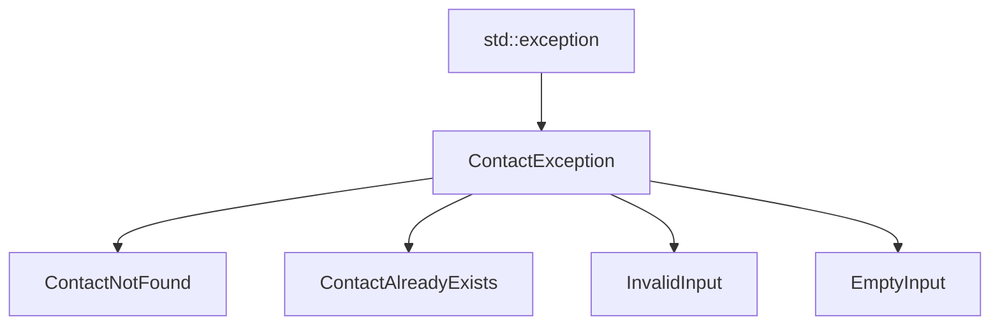
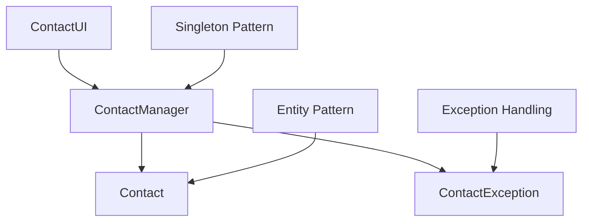
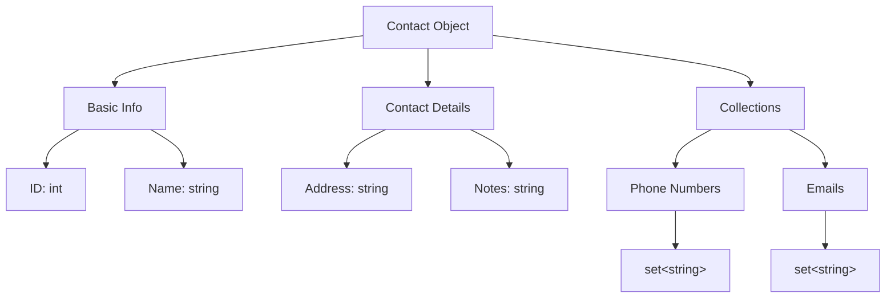
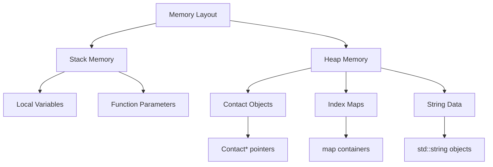
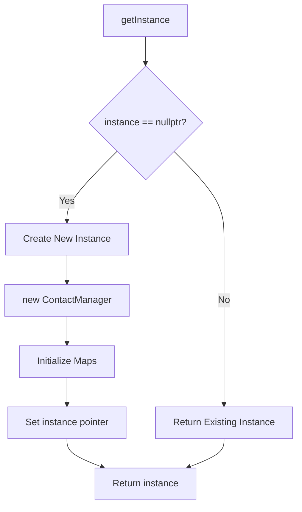
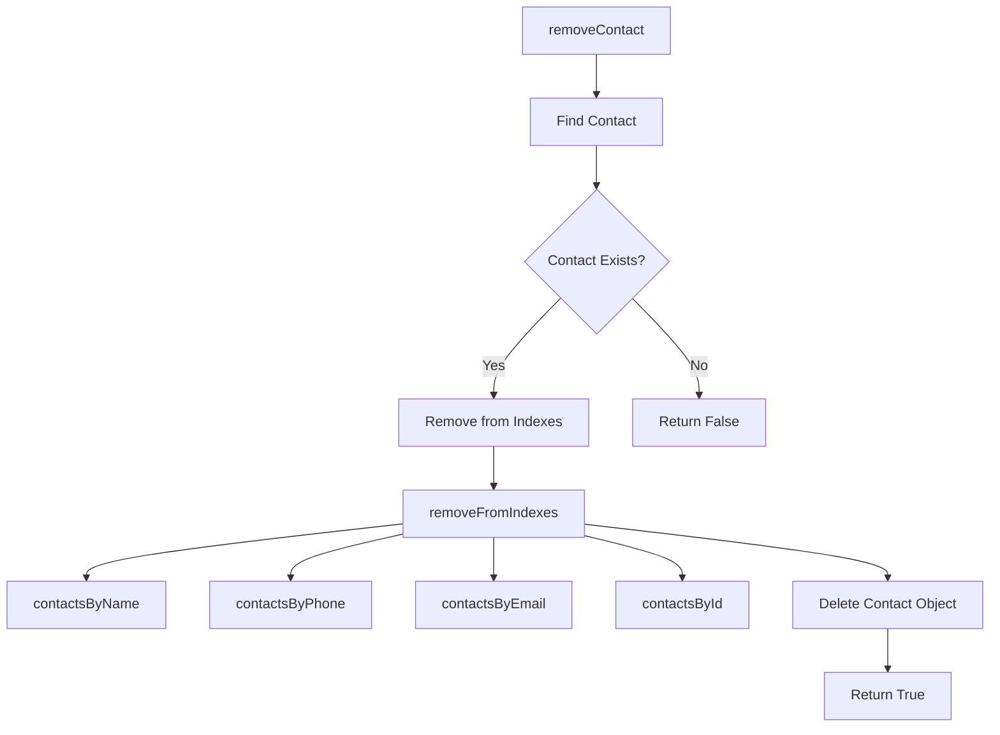

# 🌳 Sơ Đồ Cây Cấu Trúc Dữ Liệu Dự Án

## 📋 Tổng Quan

Tài liệu này mô tả các cấu trúc dữ liệu chính được sử dụng trong hệ thống quản lý danh bạ C++, bao gồm:
- Cây phân cấp lớp (Class Hierarchy Trees)
- Cây tổ chức dữ liệu (Data Organization Trees)
- Cây cấu trúc bộ nhớ (Memory Layout Trees)
- Cây thuật toán tìm kiếm (Search Algorithm Trees)

---

## 1. 🌿 Cây Phân Cấp Lớp (Class Hierarchy Tree)

### 1.1 Cây Kế Thừa Exception



### 1.2 Cây Quan Hệ Lớp Chính



---

## 2. 🗂️ Cây Tổ Chức Dữ Liệu (Data Organization Trees)

### 2.1 Cây Cấu Trúc Contact



### 2.2 Cây Indexing System

```mermaid
graph TD
    A[ContactManager] --> B[Primary Indexes]
    A --> C[Secondary Indexes]

    B --> B1[contactsById<br/>map&lt;int, Contact*&gt;]
    B --> B2[contactsByName<br/>map&lt;string, Contact*&gt;]

    C --> C1[contactsByPhone<br/>map&lt;string, Contact*&gt;]
    C --> C2[contactsByEmail<br/>map&lt;string, Contact*&gt;]

    B1 --> B1A[O(log n) Lookup]
    B2 --> B2A[O(log n) Lookup]
    C1 --> C1A[O(log n) Lookup]
    C2 --> C2A[O(log n) Lookup]
```

### 2.3 Cây Cấu Trúc Bộ Nhớ



---

## 3. 🔍 Cây Thuật Toán Tìm Kiếm (Search Algorithm Trees)

### 3.1 Cây Tìm Kiếm Theo Tên

```mermaid
graph TD
    A[searchByName] --> B[Input Validation]
    B --> C[Map Lookup]

    C --> C1[contactsByName.find]
    C1 --> C2[O(log n) Complexity]

    C2 --> D{Found?}
    D -->|Yes| E[Return Contact*]
    D -->|No| F[Return Empty Set]
```

### 3.2 Cây Tìm Kiếm Theo Số Điện Thoại

```mermaid
graph TD
    A[searchByPhone] --> B[Phone Validation]
    B --> C[Map Lookup]

    C --> C1[contactsByPhone.find]
    C1 --> C2[O(log n) Complexity]

    C2 --> D{Found?}
    D -->|Yes| E[Return Contact*]
    D -->|No| F[Return Empty Set]

    B --> B1[isValidPhone]
    B1 --> B2[Format Check]
```

### 3.3 Cây Tìm Kiếm Theo Email

```mermaid
graph TD
    A[searchByEmail] --> B[Email Validation]
    B --> C[Map Lookup]

    C --> C1[contactsByEmail.find]
    C1 --> C2[O(log n) Complexity]

    C2 --> D{Found?}
    D -->|Yes| E[Return Contact*]
    D -->|No| F[Return Empty Set]

    B --> B1[isValidEmail]
    B1 --> B2[Format Check]
```

---

## 4. 🏗️ Cây Cấu Trúc Singleton

### 4.1 Cây Khởi Tạo Singleton



---

## 5. 📊 Cây Phân Tích Độ Phức Tạp (Complexity Analysis Trees)

### 5.1 Cây Độ Phức Tạp Thời Gian

```mermaid
graph TD
    A[Time Complexity] --> B[O(1) Operations]
    A --> C[O(log n) Operations]
    A --> D[O(n) Operations]

    B --> B1[getInstance]
    B --> B2[isEmpty]
    B --> B3[getTotalContacts]

    C --> C1[findContact]
    C --> C2[searchByName]
    C --> C3[searchByPhone]
    C --> C4[searchByEmail]

    D --> D1[displayAllContacts]
    D --> D2[clearAll]
```

### 5.2 Cây Độ Phức Tạp Không Gian

```mermaid
graph TD
    A[Space Complexity] --> B[O(1) Space]
    A --> C[O(n) Space]

    B --> B1[Local Variables]
    B --> B2[Function Parameters]

    C --> C1[Contact Objects]
    C --> C2[Index Maps]
    C --> C3[String Storage]

    C1 --> C1A[n contacts]
    C2 --> C2A[4 maps × n entries]
    C3 --> C3A[Variable string lengths]
```

---

## 6. 🔄 Cây Luồng Dữ Liệu (Data Flow Trees)

### 6.1 Cây Thêm Contact Mới

```mermaid
graph TD
    A[addContact] --> B[Input Validation]
    B --> C[Create Contact Object]

    C --> C1[new Contact(name)]
    C1 --> C2[Generate Unique ID]

    C2 --> D[Add to Indexes]
    D --> D1[addToIndexes]

    D1 --> E1[contactsByName]
    D1 --> E2[contactsByPhone]
    D1 --> E3[contactsByEmail]
    D1 --> E4[contactsById]
```

### 6.2 Cây Xóa Contact



---

## 7. 📈 Cây Tối Ưu Hóa (Optimization Trees)

### 7.1 Cây Tối Ưu Tìm Kiếm

```mermaid
graph TD
    A[Search Optimization] --> B[Index Strategy]
    A --> C[Memory Management]
    A --> D[Algorithm Choice]

    B --> B1[Multiple Indexes]
    B1 --> B2[O(log n) Lookup]

    C --> C1[Smart Pointers]
    C1 --> C2[RAII Principles]

    D --> D1[Map-based Search]
    D1 --> D2[Binary Search Tree]
```

---

## 📝 Ghi Chú

### Đặc Điểm Chính:
- **Indexing Strategy**: Sử dụng 4 map riêng biệt để tối ưu tìm kiếm
- **Memory Efficiency**: Sử dụng con trỏ để tránh copy dữ liệu
- **Time Complexity**: O(log n) cho hầu hết các thao tác tìm kiếm
- **Space Complexity**: O(n) cho lưu trữ dữ liệu

### Lợi Ích:
1. **Tìm kiếm nhanh** với độ phức tạp O(log n)
2. **Quản lý bộ nhớ hiệu quả** với RAII
3. **Cấu trúc rõ ràng** và dễ bảo trì
4. **Khả năng mở rộng** cho các tính năng mới

### Hạn Chế:
1. **Sử dụng bộ nhớ** cao hơn do duplicate indexes
2. **Độ phức tạp** khi thêm/xóa contact
3. **Không hỗ trợ** tìm kiếm fuzzy hoặc partial match
