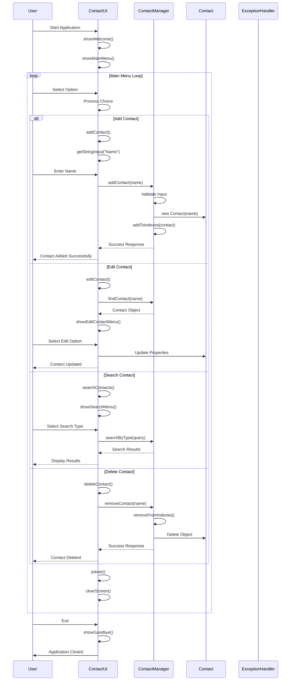
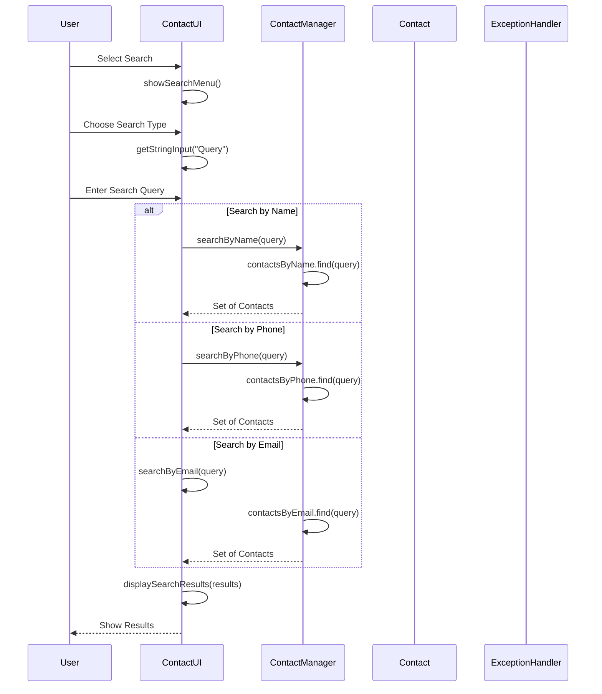
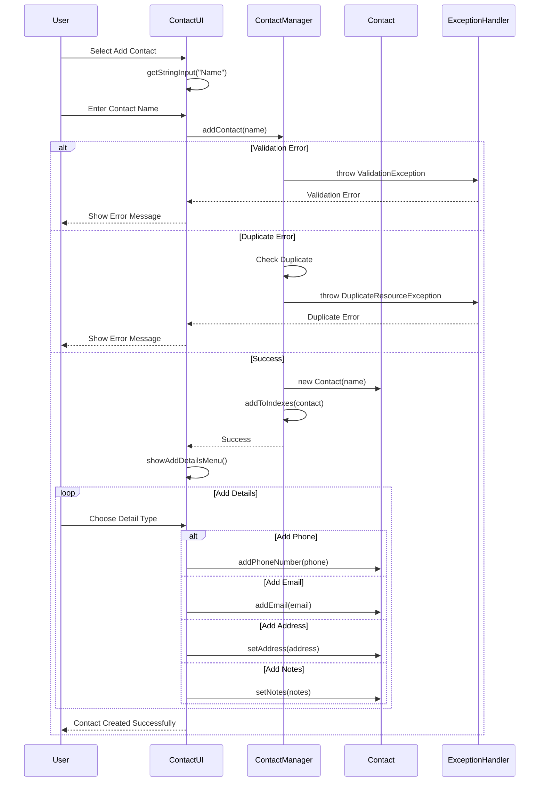
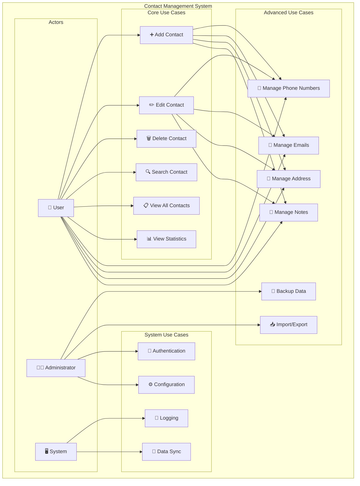
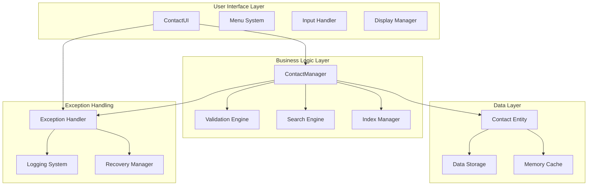
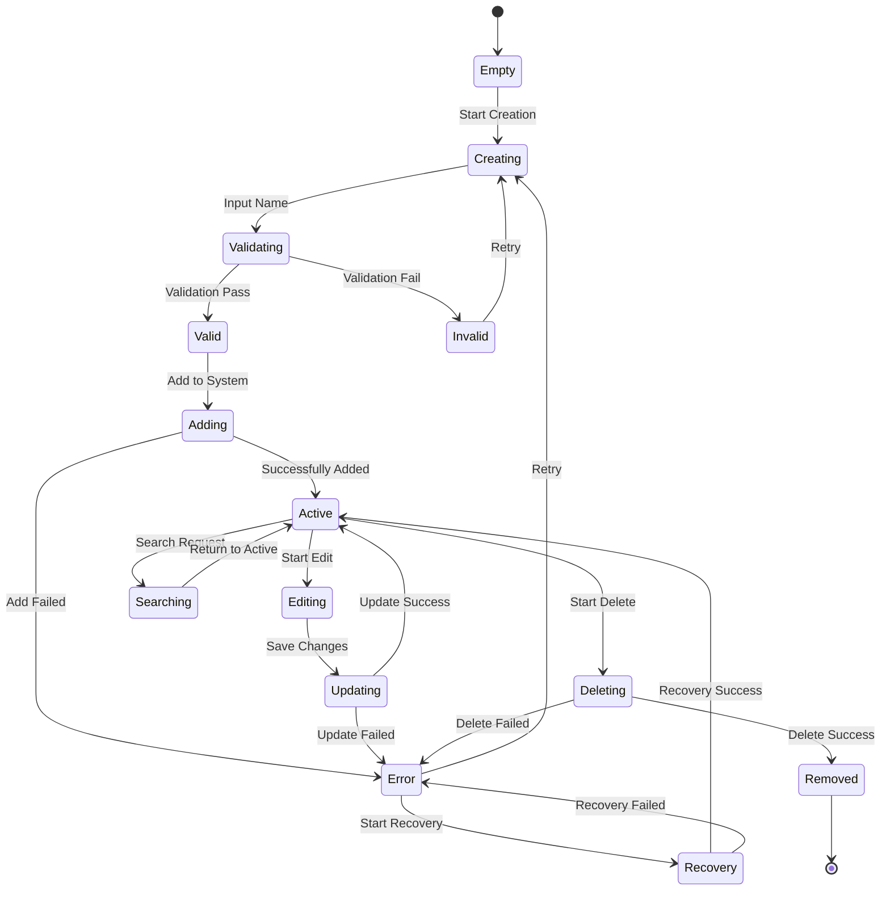
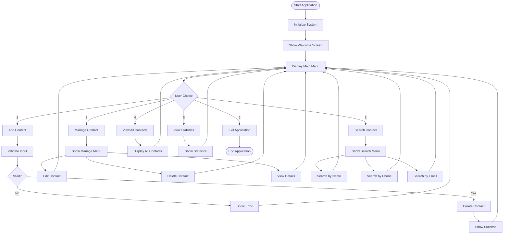
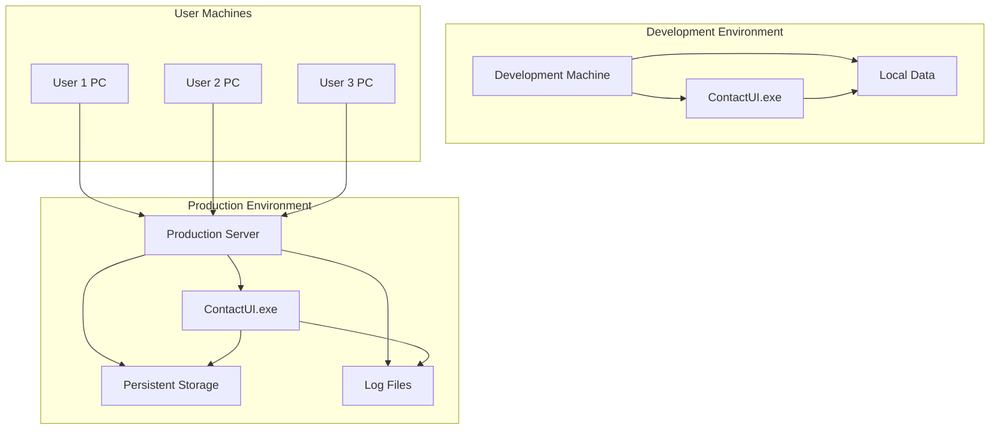
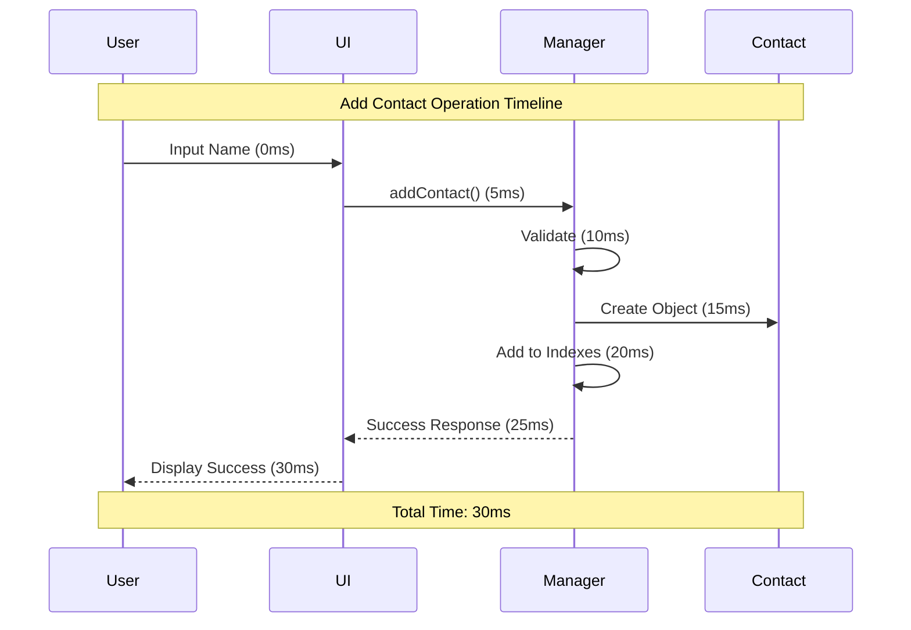

# SƠ ĐỒ UML - HỆ THỐNG QUẢN LÝ DANH BẠ

## Tổng Quan

Tài liệu này cung cấp các sơ đồ UML chi tiết cho hệ thống quản lý danh bạ, bao gồm Class Diagram, Sequence Diagram, Use Case Diagram và các diagram khác để mô tả kiến trúc và luồng hoạt động của hệ thống.

## 1. Class Diagram

### 🏗️ Class Diagram Chính

```mermaid
classDiagram
    class Contact {
        -string name
        -set<string> phoneNumbers
        -set<string> emails
        -string address
        -string notes
        -int id
        -static int nextId
        
        +Contact()
        +Contact(string name)
        +int getId()
        +string getName()
        +set<string> getPhoneNumbers()
        +set<string> getEmails()
        +string getAddress()
        +string getNotes()
        +void setName(string)
        +void setAddress(string)
        +void setNotes(string)
        +void addPhoneNumber(string)
        +void removePhoneNumber(string)
        +void addEmail(string)
        +void removeEmail(string)
        +bool hasPhoneNumber(string)
        +bool hasEmail(string)
        +void display()
        +string toString()
    }
    
    class ContactManager {
        -static ContactManager* instance
        -map<string, Contact*> contactsByName
        -map<string, Contact*> contactsByPhone
        -map<string, Contact*> contactsByEmail
        -map<int, Contact*> contactsById
        
        +static ContactManager* getInstance()
        +bool addContact(string)
        +bool removeContact(int)
        +bool removeContact(string)
        +Contact* findContact(int)
        +Contact* findContact(string)
        +set<Contact*> searchByName(string)
        +set<Contact*> searchByPhone(string)
        +set<Contact*> searchByEmail(string)
        +void displayAllContacts()
        +void displayContact(int)
        +void displayContact(string)
        +int getTotalContacts()
        +bool isEmpty()
        +void clearAll()
        -void removeFromIndexes(Contact*)
        -void addToIndexes(Contact*)
        -bool isValidPhone(string)
        -bool isValidEmail(string)
    }
    
    class ContactUI {
        -ContactManager* manager
        
        +ContactUI()
        +~ContactUI()
        +void run()
        +void showWelcome()
        +void showGoodbye()
        -void showMainMenu()
        -void showContactMenu()
        -void showSearchMenu()
        -string getStringInput(string)
        -int getIntInput(string)
        -void clearScreen()
        -void pause()
        -bool isValidPhoneNumber(string)
        -bool isValidEmail(string)
        -void addContact()
        -void editContact()
        -void deleteContact()
        -void viewContact()
        -void searchContacts()
        -void displayAllContacts()
    }
    
    class ContactException {
        -string message
        -string errorCode
        -string module
        -int severity
        
        +ContactException(string, string, string, int)
        +virtual const char* what()
        +string getErrorCode()
        +string getModule()
        +int getSeverity()
        +virtual string getFullErrorInfo()
    }
    
    class ValidationException {
        +ValidationException(string, string)
    }
    
    class ResourceNotFoundException {
        +ResourceNotFoundException(string, string)
    }
    
    class DuplicateResourceException {
        +DuplicateResourceException(string, string)
    }
    
    class SystemException {
        +SystemException(string)
    }
    
    ContactManager ||--o{ Contact : manages
    ContactUI --> ContactManager : uses
    ContactException <|-- ValidationException
    ContactException <|-- ResourceNotFoundException
    ContactException <|-- DuplicateResourceException
    ContactException <|-- SystemException
    ContactManager --> ContactException : throws
```

### 📊 Detailed Class Relationships

```mermaid
classDiagram
    class Contact {
        <<Entity>>
        -string name
        -set<string> phoneNumbers
        -set<string> emails
        -string address
        -string notes
        -int id
        -static int nextId
    }
    
    class ContactManager {
        <<Singleton>>
        -static ContactManager* instance
        -map<string, Contact*> contactsByName
        -map<string, Contact*> contactsByPhone
        -map<string, Contact*> contactsByEmail
        -map<int, Contact*> contactsById
    }
    
    class ContactUI {
        <<Controller>>
        -ContactManager* manager
    }
    
    class ContactException {
        <<Exception>>
        -string message
        -string errorCode
        -string module
        -int severity
    }
    
    ContactManager "1" ||--o{ "0..*" Contact : manages
    ContactUI "1" --> "1" ContactManager : uses
    ContactException <|-- ValidationException : inheritance
    ContactException <|-- ResourceNotFoundException : inheritance
    ContactException <|-- DuplicateResourceException : inheritance
    ContactException <|-- SystemException : inheritance
    ContactManager --> ContactException : throws
```

## 2. Sequence Diagram

### 🔄 Main Application Flow



### 🔍 Search Operation Flow



### ➕ Add Contact Flow



## 3. Use Case Diagram

### 👥 Use Case Overview



## 4. Component Diagram

### 🧩 System Components



## 5. State Diagram

### 🔄 Contact Lifecycle



## 6. Activity Diagram

### 🔄 Main Application Flow



## 7. Package Diagram

### 📦 System Architecture

```mermaid
graph TB
    subgraph "Contact Management System"
        subgraph "UI Package"
            ContactUI
            MenuSystem
            InputHandler
            DisplayManager
        end
        
        subgraph "Core Package"
            ContactManager
            Contact
            ContactException
        end
        
        subgraph "Exception Package"
            ValidationException
            ResourceNotFoundException
            DuplicateResourceException
            SystemException
        end
        
        subgraph "Utility Package"
            Logger
            Validator
            IndexManager
        end
    end
    
    UI Package --> Core Package
    Core Package --> Exception Package
    Core Package --> Utility Package
    Exception Package --> Utility Package
```

## 8. Object Diagram

### 🎯 System State Example

```mermaid
graph TB
    subgraph "ContactManager Instance"
        CM[ContactManager: instance]
        CM_ByName[contactsByName: map]
        CM_ByPhone[contactsByPhone: map]
        CM_ByEmail[contactsByEmail: map]
        CM_ById[contactsById: map]
    end
    
    subgraph "Contact Objects"
        C1[Contact: id=1, name="John Doe"]
        C2[Contact: id=2, name="Jane Smith"]
        C3[Contact: id=3, name="Bob Johnson"]
    end
    
    subgraph "Index Mappings"
        CM_ByName --> C1
        CM_ByName --> C2
        CM_ByName --> C3
        
        CM_ByPhone --> C1
        CM_ByPhone --> C2
        CM_ByPhone --> C3
        
        CM_ByEmail --> C1
        CM_ByEmail --> C2
        CM_ByEmail --> C3
        
        CM_ById --> C1
        CM_ById --> C2
        CM_ById --> C3
    end
```

## 9. Deployment Diagram

### 🚀 System Deployment



## 10. Timing Diagram

### ⏱️ Operation Timing



## Kết Luận

### 🎯 Tóm Tắt UML Diagrams

Các sơ đồ UML trên cung cấp cái nhìn toàn diện về:

1. **Class Structure**: Kiến trúc classes và relationships
2. **System Flow**: Luồng hoạt động của hệ thống
3. **User Interactions**: Cách users tương tác với system
4. **Component Architecture**: Cấu trúc components
5. **State Management**: Quản lý trạng thái của objects
6. **System Deployment**: Cách hệ thống được triển khai

### 🚀 Lợi Ích

- **Documentation**: Tài liệu kỹ thuật chi tiết
- **Communication**: Giao tiếp hiệu quả giữa team members
- **Design Review**: Review và validate thiết kế
- **Implementation Guide**: Hướng dẫn implement
- **Maintenance**: Dễ dàng maintain và extend system

### 💡 Sử Dụng

1. **Development**: Hướng dẫn implement cho developers
2. **Testing**: Thiết kế test cases
3. **Documentation**: Tài liệu kỹ thuật
4. **Training**: Training cho team members mới
5. **Architecture Review**: Review kiến trúc hệ thống

---

*Các sơ đồ UML này sẽ được cập nhật khi có thay đổi trong kiến trúc hệ thống.*
