# 📋 TÀI LIỆU THIẾT KẾ UML - HỆ THỐNG QUẢN LÝ DANH BẠ THÔNG MINH

## 🎯 TỔNG QUAN HỆ THỐNG

Hệ thống Quản lý Danh bạ Thông minh là một ứng dụng C++ được thiết kế theo mô hình **Singleton Pattern** và **MVC (Model-View-Controller)** với giao diện dòng lệnh (CLI). Hệ thống sử dụng các cấu trúc dữ liệu tối ưu để đảm bảo hiệu suất cao trong các thao tác tìm kiếm và quản lý liên hệ.

---

## 🏗️ KIẾN TRÚC TỔNG THỂ

```
┌─────────────────────────────────────────────────────────────┐
│                    MAIN APPLICATION                        │
├─────────────────────────────────────────────────────────────┤
│  main.cpp                                                  │
│  └── Khởi tạo ContactUI và xử lý exception toàn cục      │
└─────────────────────────────────────────────────────────────┘
                              │
                              ▼
┌─────────────────────────────────────────────────────────────┐
│                    PRESENTATION LAYER                      │
├─────────────────────────────────────────────────────────────┤
│  ContactUI (View + Controller)                            │
│  ├── Giao diện người dùng                                 │
│  ├── Xử lý input/output                                   │
│  ├── Validation dữ liệu                                   │
│  └── Điều hướng người dùng                               │
└─────────────────────────────────────────────────────────────┘
                              │
                              ▼
┌─────────────────────────────────────────────────────────────┐
│                     BUSINESS LOGIC LAYER                   │
├─────────────────────────────────────────────────────────────┤
│  ContactManager (Singleton)                                │
│  ├── Quản lý dữ liệu liên hệ                              │
│  ├── Xử lý business logic                                 │
│  ├── Validation và kiểm tra trùng lặp                     │
│  └── Quản lý các index tìm kiếm                          │
└─────────────────────────────────────────────────────────────┘
                              │
                              ▼
┌─────────────────────────────────────────────────────────────┐
│                      DATA LAYER                           │
├─────────────────────────────────────────────────────────────┤
│  Contact (Model)                                           │
│  ├── Đại diện cho một liên hệ                             │
│  ├── Quản lý thông tin cá nhân                            │
│  └── Validation dữ liệu cơ bản                            │
└─────────────────────────────────────────────────────────────┘
                              │
                              ▼
┌─────────────────────────────────────────────────────────────┐
│                   EXCEPTION HANDLING                      │
├─────────────────────────────────────────────────────────────┤
│  ContactException (Exception Hierarchy)                   │
│  ├── Xử lý lỗi chung                                      │
│  ├── Xử lý lỗi cụ thể                                     │
│  └── Thông báo lỗi thân thiện                             │
└─────────────────────────────────────────────────────────────┘
```

---

## 📊 SƠ ĐỒ LỚP (CLASS DIAGRAM)

### 1. LỚP CONTACT (MODEL)

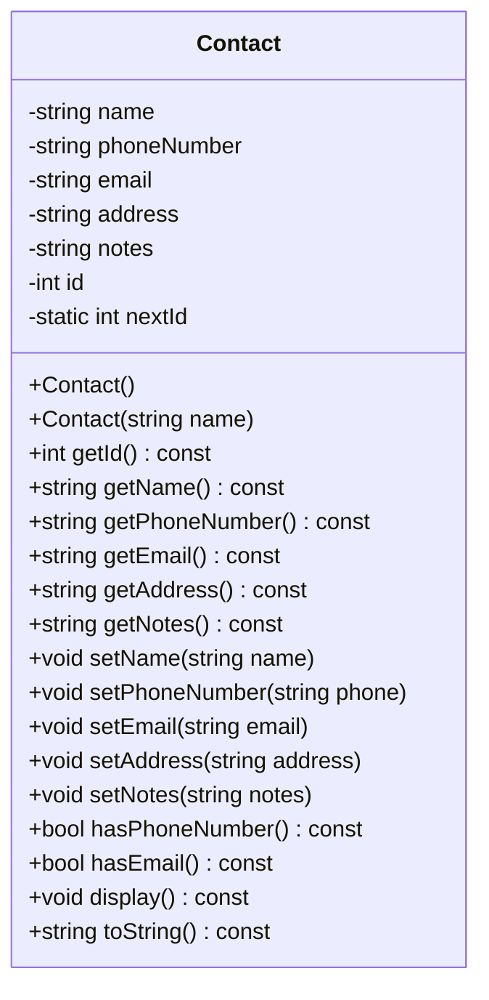

**Mô tả chi tiết:**
- **Thuộc tính:**
  - `name`: Tên liên hệ (bắt buộc, duy nhất)
  - `phoneNumber`: Số điện thoại (tối đa 11 số, duy nhất)
  - `email`: Địa chỉ email (duy nhất, format chuẩn)
  - `address`: Địa chỉ (tùy chọn)
  - `notes`: Ghi chú (tùy chọn)
  - `id`: ID tự động tăng (duy nhất)
  - `nextId`: Biến static để quản lý ID

- **Phương thức chính:**
  - **Constructors**: Tạo liên hệ mới với ID tự động
  - **Getters/Setters**: Truy cập và cập nhật thông tin
  - **Validation**: Kiểm tra có số điện thoại/email không
  - **Display**: Hiển thị thông tin liên hệ
  - **toString**: Chuyển đổi thành chuỗi

### 2. LỚP CONTACTMANAGER (SINGLETON)

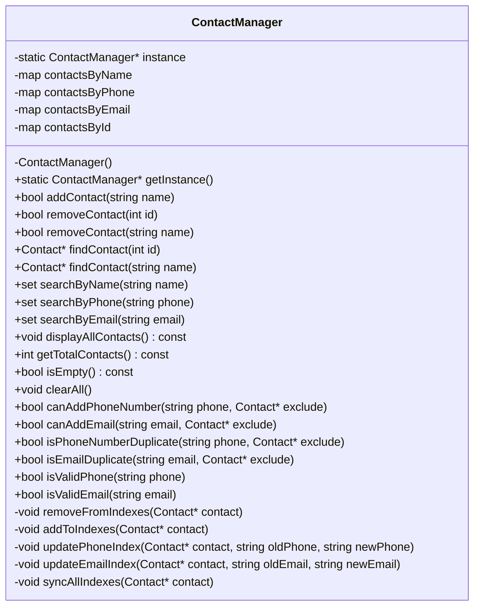

**Mô tả chi tiết:**
- **Design Pattern:** Singleton - Đảm bảo chỉ có một instance duy nhất
- **Cấu trúc dữ liệu:**
  - `contactsByName`: Map tên → Contact (O(log n) tìm kiếm)
  - `contactsByPhone`: Map số điện thoại → Contact (O(log n) tìm kiếm)
  - `contactsByEmail`: Map email → Contact (O(log n) tìm kiếm)
  - `contactsById`: Map ID → Contact (O(log n) tìm kiếm)

- **Chức năng chính:**
  - **CRUD Operations**: Thêm, xóa, tìm kiếm, hiển thị liên hệ
  - **Index Management**: Quản lý các index để tối ưu tìm kiếm
  - **Validation**: Kiểm tra tính hợp lệ và trùng lặp
  - **Search**: Tìm kiếm theo nhiều tiêu chí khác nhau

### 3. LỚP CONTACTUI (VIEW + CONTROLLER)

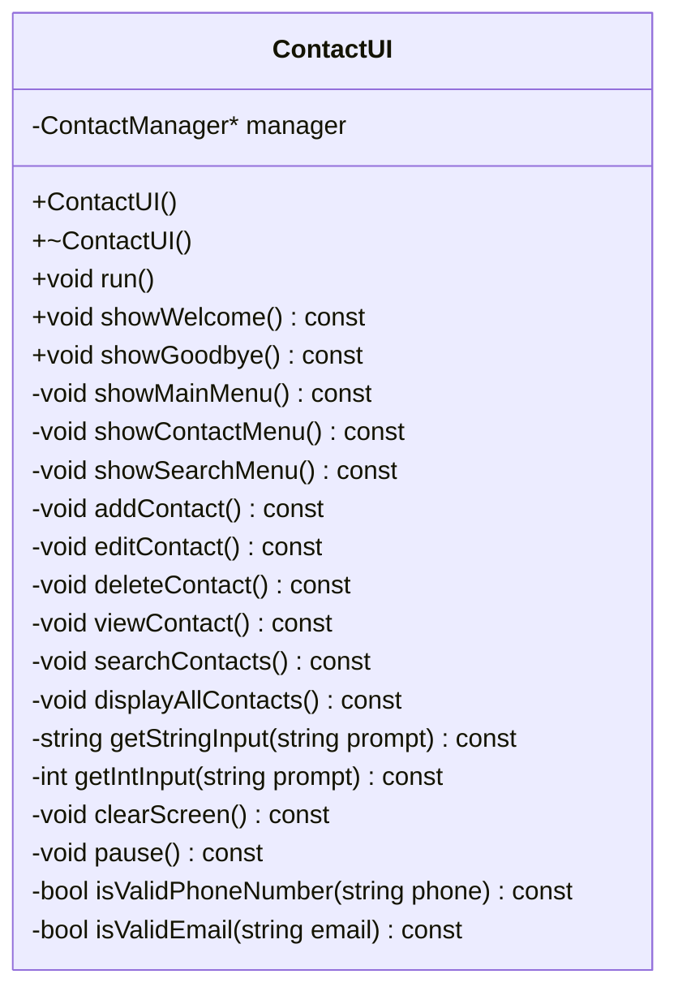

**Mô tả chi tiết:**
- **Vai trò:** Kết hợp View và Controller trong mô hình MVC
- **Chức năng:**
  - **User Interface**: Hiển thị menu và nhận input từ người dùng
  - **Input Validation**: Kiểm tra tính hợp lệ của dữ liệu đầu vào
  - **Navigation**: Điều hướng giữa các menu và chức năng
  - **Display**: Hiển thị kết quả và thông báo cho người dùng

### 4. LỚP CONTACTEXCEPTION (EXCEPTION HIERARCHY)

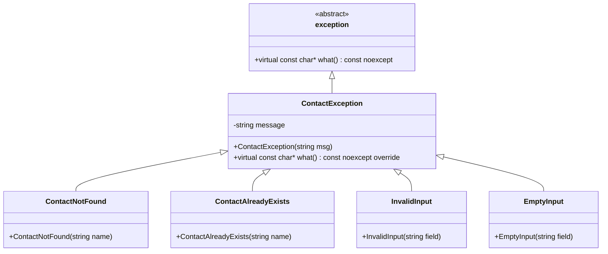

**Mô tả chi tiết:**
- **Kế thừa từ:** `std::exception` (C++ standard library)
- **Các loại exception:**
  - `ContactNotFound`: Liên hệ không tồn tại
  - `ContactAlreadyExists`: Liên hệ đã tồn tại
  - `InvalidInput`: Dữ liệu đầu vào không hợp lệ
  - `EmptyInput`: Trường dữ liệu bị để trống

---

## 🔄 SƠ ĐỒ TUẦN TỰ (SEQUENCE DIAGRAM)

### 1. LUỒNG THÊM LIÊN HỆ MỚI

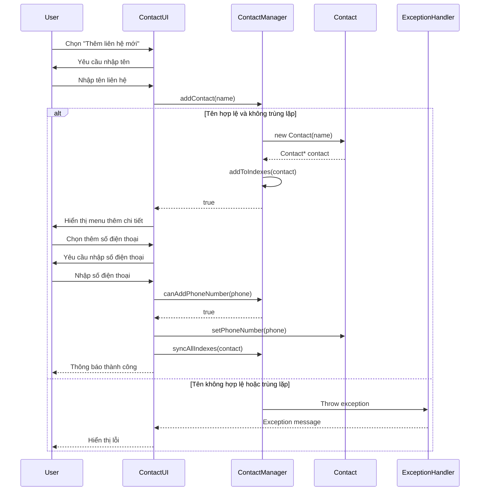

### 2. LUỒNG TÌM KIẾM LIÊN HỆ

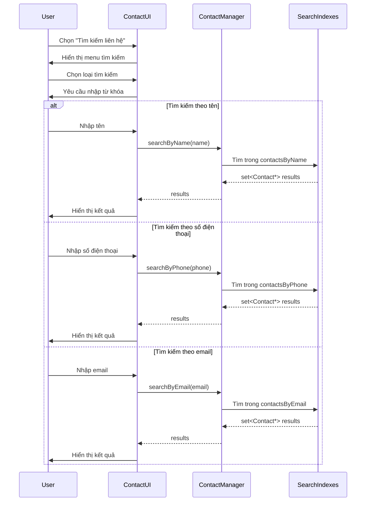

---

## 🗂️ SƠ ĐỒ CẤU TRÚC DỮ LIỆU (DATA STRUCTURE DIAGRAM)

### 1. CẤU TRÚC INDEX TỐI ƯU

```
┌─────────────────────────────────────────────────────────────┐
│                    CONTACT MANAGER                         │
├─────────────────────────────────────────────────────────────┤
│                                                             │
│  ┌─────────────────┐    ┌─────────────────┐               │
│  │ contactsByName  │    │ contactsById    │               │
│  │ (map<string,    │    │ (map<int,       │               │
│  │  Contact*>)     │    │  Contact*>)     │               │
│  │                 │    │                 │               │
│  │ "Nguyễn Văn A" │    │ 1 → Contact*    │               │
│  │ "Trần Thị B"   │    │ 2 → Contact*    │               │
│  │ "Lê Văn C"     │    │ 3 → Contact*    │               │
│  └─────────────────┘    └─────────────────┘               │
│           │                       │                       │
│           ▼                       ▼                       │
│  ┌─────────────────┐    ┌─────────────────┐               │
│  │ contactsByPhone │    │ contactsByEmail │               │
│  │ (map<string,    │    │ (map<string,    │               │
│  │  Contact*>)     │    │  Contact*>)     │               │
│  │                 │    │                 │               │
│  │ "0123456789"    │    │ "a@email.com"   │               │
│  │ "0987654321"    │    │ "b@email.com"   │               │
│  │ "1122334455"    │    │ "c@email.com"   │               │
│  └─────────────────┘    └─────────────────┘               │
│                                                             │
└─────────────────────────────────────────────────────────────┘
```

**Ưu điểm của cấu trúc index:**
- **Tìm kiếm theo tên:** O(log n) thay vì O(n)
- **Tìm kiếm theo số điện thoại:** O(log n) thay vì O(n)
- **Tìm kiếm theo email:** O(log n) thay vì O(n)
- **Tìm kiếm theo ID:** O(log n) thay vì O(n)
- **Đảm bảo tính duy nhất:** Không có số điện thoại/email trùng lặp

### 2. CẤU TRÚC DỮ LIỆU LIÊN HỆ

```
┌─────────────────────────────────────────────────────────────┐
│                        CONTACT                             │
├─────────────────────────────────────────────────────────────┤
│                                                             │
│  ┌─────────────┐  ┌─────────────┐  ┌─────────────┐        │
│  │     ID      │  │    Name     │  │   Phone     │        │
│  │   (int)     │  │  (string)   │  │  (string)   │        │
│  │   Auto      │  │  Required   │  │ Max 11      │        │
│  │  Increment  │  │  Unique     │  │  Unique     │        │
│  └─────────────┘  └─────────────┘  └─────────────┘        │
│                                                             │
│  ┌─────────────┐  ┌─────────────┐  ┌─────────────┐        │
│  │    Email    │  │   Address   │  │    Notes    │        │
│  │  (string)   │  │  (string)   │  │  (string)   │        │
│  │   Unique    │  │  Optional   │  │  Optional   │        │
│  │   Format    │  │             │  │             │        │
│  └─────────────┘  └─────────────┘  └─────────────┘        │
│                                                             │
└─────────────────────────────────────────────────────────────┘
```

---

## 🔍 SƠ ĐỒ LUỒNG XỬ LÝ (FLOWCHART)

### 1. LUỒNG XỬ LÝ CHÍNH

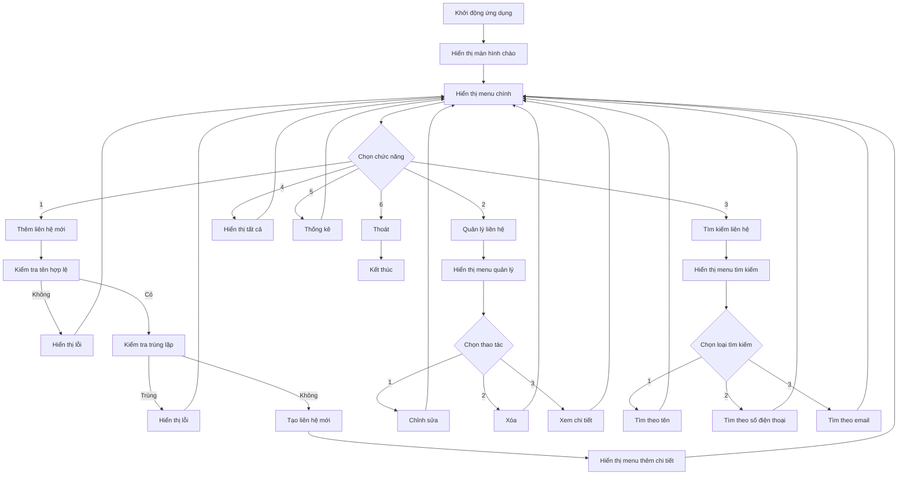

### 2. LUỒNG VALIDATION DỮ LIỆU

```mermaid
flowchart TD
    A[Nhập dữ liệu] --> B{Kiểm tra rỗng}
    B --> C[Hiển thị lỗi "Không được để trống"]
    B --> D{Kiểm tra loại dữ liệu}
    
    D --> E{Độ dài >= 2 ký tự}
    D --> F{Độ dài <= 11 và chỉ chứa số}
    D --> G{Kiểm tra format email}
    D --> H{Độ dài >= 5 ký tự}
    
    E --> I[Hiển thị lỗi "Tên phải >= 2 ký tự"]
    E --> J[Kiểm tra trùng lặp]
    
    F --> K[Hiển thị lỗi "Số điện thoại không hợp lệ"]
    F --> L[Kiểm tra trùng lặp]
    
    G --> M[Hiển thị lỗi "Email không hợp lệ"]
    G --> N[Kiểm tra trùng lặp]
    
    H --> O[Hiển thị lỗi "Địa chỉ phải >= 5 ký tự"]
    H --> P[Dữ liệu hợp lệ]
    
    J --> Q[Hiển thị lỗi "Đã tồn tại"]
    J --> P
    
    L --> R[Hiển thị lỗi "Số điện thoại đã tồn tại"]
    L --> P
    
    N --> S[Hiển thị lỗi "Email đã tồn tại"]
    N --> P
    
    C --> T[Yêu cầu nhập lại]
    I --> T
    K --> T
    M --> T
    O --> T
    Q --> T
    R --> T
    S --> T
    
    P --> U[Lưu dữ liệu]
    T --> A
```

---

## 🎨 SƠ ĐỒ TRẠNG THÁI (STATE DIAGRAM)

### 1. TRẠNG THÁI LIÊN HỆ

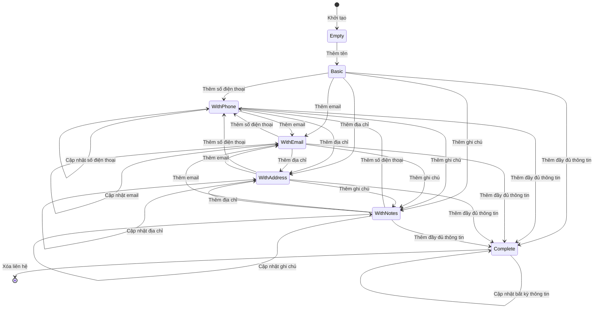

### 2. TRẠNG THÁI ỨNG DỤNG

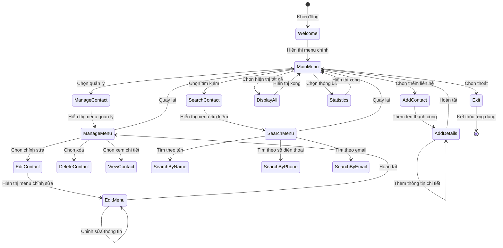

---

## 🔧 SƠ ĐỒ COMPONENT (COMPONENT DIAGRAM)

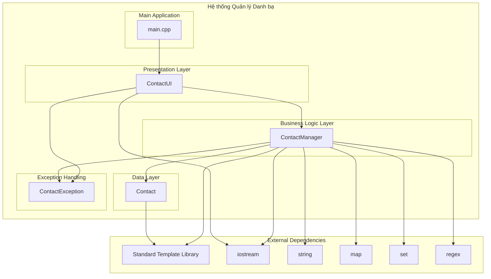

---

## 📈 SƠ ĐỒ HOẠT ĐỘNG (ACTIVITY DIAGRAM)

### 1. HOẠT ĐỘNG THÊM LIÊN HỆ

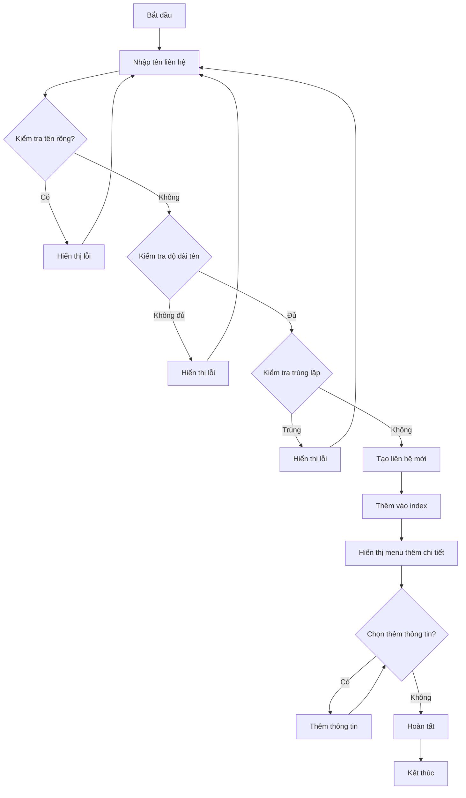

### 2. HOẠT ĐỘNG TÌM KIẾM

```mermaid
graph TD
    A[Bắt đầu tìm kiếm] --> B{Chọn loại tìm kiếm}
    B -->|Theo tên| C[Nhập tên cần tìm]
    B -->|Theo số điện thoại| D[Nhập số điện thoại]
    B -->|Theo email| E[Nhập email]
    
    C --> F[Tìm kiếm trong index tên]
    D --> G[Tìm kiếm trong index số điện thoại]
    E --> H[Tìm kiếm trong index email]
    
    F --> I{Đã tìm thấy?}
    G --> I
    H --> I
    
    I -->|Có| J[Hiển thị kết quả]
    I -->|Không| K[Hiển thị "Không tìm thấy"]
    
    J --> L[Kết thúc]
    K --> L
```

---

## 🚀 TÍNH NĂNG VÀ ƯU ĐIỂM

### 1. **TÍNH NĂNG CHÍNH**
- ✅ **Quản lý liên hệ hoàn chỉnh**: Thêm, sửa, xóa, xem liên hệ
- ✅ **Tìm kiếm đa tiêu chí**: Theo tên, số điện thoại, email
- ✅ **Validation dữ liệu**: Kiểm tra tính hợp lệ và trùng lặp
- ✅ **Giao diện thân thiện**: Menu rõ ràng, thông báo chi tiết
- ✅ **Xử lý lỗi tốt**: Exception handling toàn diện

### 2. **ƯU ĐIỂM THIẾT KẾ**
- 🚀 **Hiệu suất cao**: Sử dụng map/set cho O(log n) operations
- 🏗️ **Kiến trúc rõ ràng**: Tách biệt các layer rõ ràng
- 🔒 **An toàn dữ liệu**: Kiểm tra trùng lặp và validation
- 📱 **Dễ mở rộng**: Có thể thêm tính năng mới dễ dàng
- 🧪 **Dễ test**: Các class độc lập, dễ viết unit test

### 3. **TỐI ƯU HÓA**
- **Index Management**: Quản lý index thông minh để tìm kiếm nhanh
- **Memory Management**: Sử dụng con trỏ và quản lý bộ nhớ hiệu quả
- **Exception Safety**: Xử lý exception an toàn, không bị crash
- **User Experience**: Giao diện thân thiện, thông báo rõ ràng

---

## 🔍 PHÂN TÍCH ĐỘ PHỨC TẠP

### 1. **TIME COMPLEXITY**
- **Thêm liên hệ**: O(log n) - do insert vào map
- **Xóa liên hệ**: O(log n) - do delete từ map
- **Tìm kiếm theo ID**: O(log n) - do search trong map
- **Tìm kiếm theo tên**: O(log n) - do search trong map
- **Tìm kiếm theo số điện thoại**: O(log n) - do search trong map
- **Tìm kiếm theo email**: O(log n) - do search trong map
- **Hiển thị tất cả**: O(n) - do phải duyệt qua tất cả

### 2. **SPACE COMPLEXITY**
- **Lưu trữ liên hệ**: O(n) - n là số lượng liên hệ
- **Index structures**: O(n) - mỗi index chứa n phần tử
- **Tổng bộ nhớ**: O(n) - tuyến tính với số lượng liên hệ

---

## 🛠️ HƯỚNG DẪN SỬ DỤNG

### 1. **BIÊN DỊCH VÀ CHẠY**
```bash
# Biên dịch
make

# Chạy ứng dụng
make run

# Dọn dẹp
make clean
```

### 2. **CÁC LỆNH CHÍNH**
- **1**: Thêm liên hệ mới
- **2**: Quản lý liên hệ (sửa, xóa, xem)
- **3**: Tìm kiếm liên hệ
- **4**: Hiển thị tất cả liên hệ
- **5**: Thống kê
- **6**: Thoát

### 3. **QUY TẮC SỬ DỤNG**
- **Tên liên hệ**: Bắt buộc, duy nhất, tối thiểu 2 ký tự
- **Số điện thoại**: Tối đa 11 số, duy nhất, chỉ chứa số
- **Email**: Format chuẩn, duy nhất
- **Địa chỉ**: Tối thiểu 5 ký tự
- **Ghi chú**: Tùy chọn

---

## 🔮 HƯỚNG PHÁT TRIỂN TƯƠNG LAI

### 1. **TÍNH NĂNG MỚI**
- 📁 **Lưu trữ file**: Import/export CSV, JSON
- 🔐 **Mã hóa dữ liệu**: Bảo mật thông tin liên hệ
- 🌐 **Giao diện web**: Web interface cho ứng dụng
- 📱 **Mobile app**: Ứng dụng di động
- ☁️ **Cloud sync**: Đồng bộ đa thiết bị

### 2. **CẢI TIẾN KỸ THUẬT**
- 🗄️ **Database**: Sử dụng SQLite hoặc PostgreSQL
- 🔍 **Full-text search**: Tìm kiếm nâng cao
- 📊 **Analytics**: Thống kê và báo cáo chi tiết
- 🔄 **API**: RESTful API cho tích hợp
- 🧪 **Testing**: Unit tests và integration tests

---

## 📝 KẾT LUẬN

Hệ thống Quản lý Danh bạ Thông minh được thiết kế với kiến trúc rõ ràng, hiệu suất cao và dễ sử dụng. Sử dụng các design pattern phù hợp và cấu trúc dữ liệu tối ưu, hệ thống có thể xử lý số lượng lớn liên hệ một cách hiệu quả.

**Điểm mạnh:**
- ✅ Kiến trúc rõ ràng, dễ bảo trì
- ✅ Hiệu suất cao với index tối ưu
- ✅ Xử lý lỗi toàn diện
- ✅ Giao diện thân thiện người dùng
- ✅ Dễ mở rộng và phát triển

**Hướng phát triển:**
- 🚀 Tích hợp database
- 🌐 Phát triển giao diện web
- 📱 Xây dựng mobile app
- 🔐 Bảo mật dữ liệu
- 📊 Báo cáo và thống kê nâng cao

Hệ thống này là một nền tảng vững chắc để xây dựng các ứng dụng quản lý liên hệ chuyên nghiệp trong tương lai.
