# 📊 TÀI LIỆU UML CHUẨN - HỆ THỐNG QUẢN LÝ DANH BẠ THÔNG MINH

## 🎯 TỔNG QUAN HỆ THỐNG

Hệ thống Quản lý Danh bạ Thông minh được thiết kế theo **Modern C++ Architecture** với việc áp dụng nhiều design patterns khác nhau. Tài liệu UML này tuân thủ chuẩn **UML 2.5** và cung cấp cái nhìn toàn diện về kiến trúc hệ thống.

---

## 🏗️ KIẾN TRÚC TỔNG THỂ (SYSTEM ARCHITECTURE)

### **1. 🎯 HIGH-LEVEL ARCHITECTURE DIAGRAM**

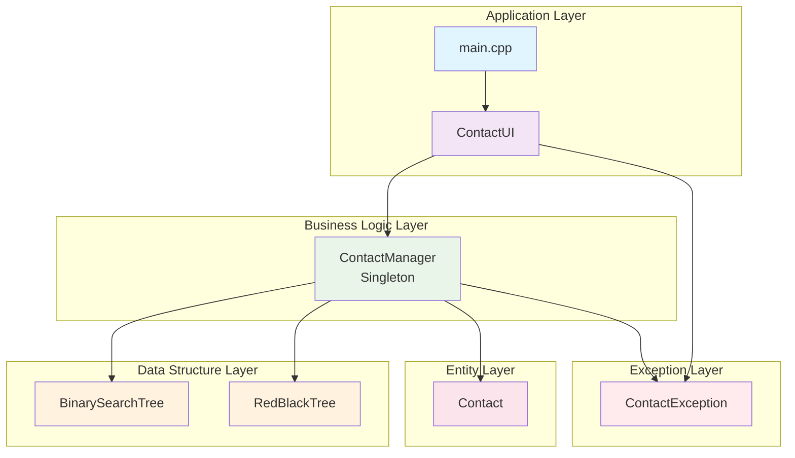

### **2. 📱 LAYER RESPONSIBILITY MATRIX**

| Layer | Components | Responsibility | Design Pattern |
|-------|------------|----------------|----------------|
| **Application** | `main.cpp` | Entry point, Global exception handling | Exception Handler |
| **Presentation** | `ContactUI` | User interface, Input validation, Navigation | MVC (View+Controller) |
| **Business Logic** | `ContactManager` | Business rules, Data management, Index sync | Singleton, Factory, Observer |
| **Data Structure** | `BST`, `RBT` | Data storage, Search optimization | Template Method, Strategy |
| **Entity** | `Contact` | Data model, Validation | Value Object |
| **Exception** | `ContactException` | Error handling, User feedback | Exception Hierarchy |

---

## 📊 CLASS DIAGRAM (CHUẨN UML 2.5)

### **1. 🏠 CONTACT ENTITY CLASS**

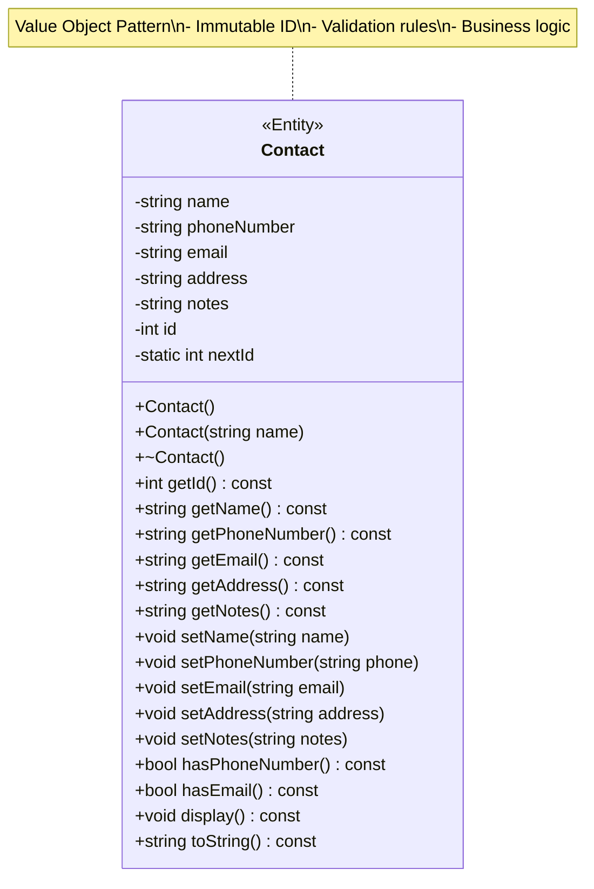

**UML Notation:**
- **<<Entity>>**: Stereotype cho entity class
- **-**: Private members (encapsulation)
- **+**: Public methods (interface)
- **~**: Destructor
- **static**: Class-level members

### **2. 🎯 CONTACT MANAGER CLASS (SINGLETON)**

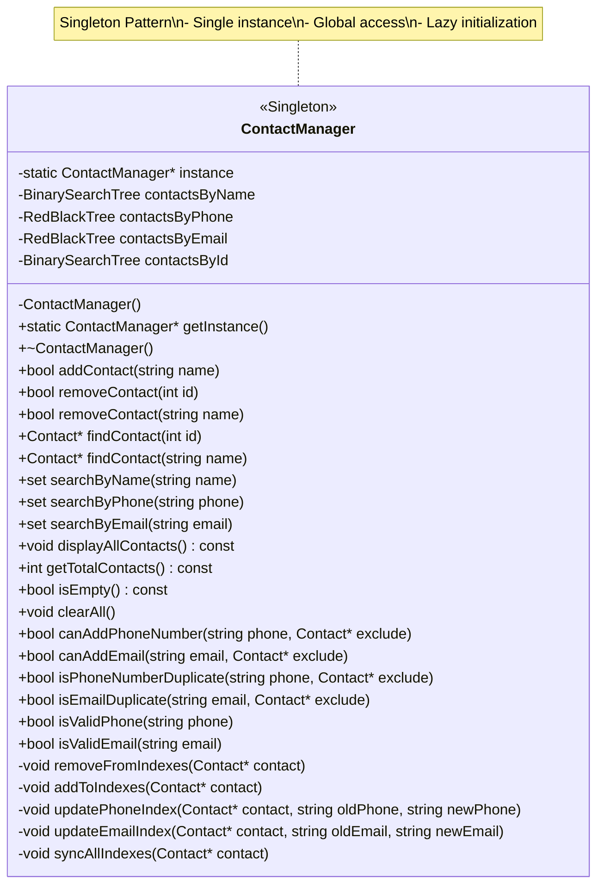

### **3. 🖥️ CONTACT UI CLASS (MVC PATTERN)**

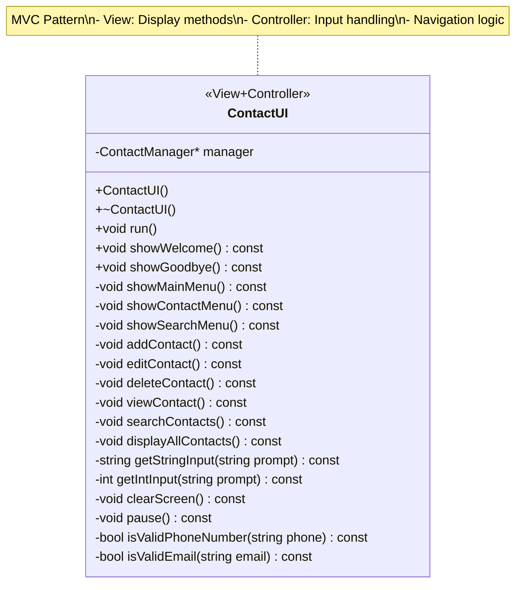

### **4. 🌳 BINARY SEARCH TREE TEMPLATE CLASS**

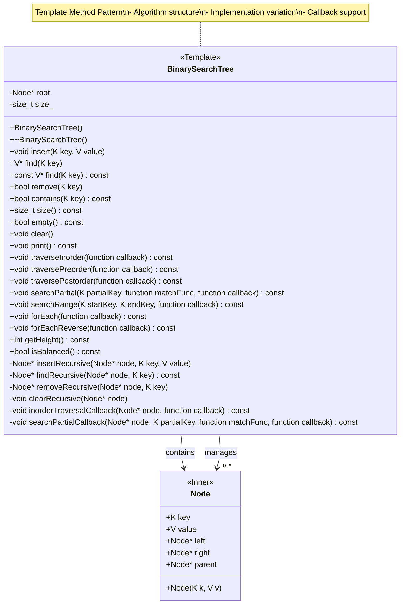

### **5. 🔴⚫ RED-BLACK TREE TEMPLATE CLASS**

```mermaid
classDiagram
    class RedBlackTree {
        <<Template>>
        <<DataStructure>>
        -Node* root
        -Node* nil
        -size_t size_
        
        +RedBlackTree()
        +~RedBlackTree()
        +void insert(K key, V value)
        +V* find(K key)
        +const V* find(K key) const
        +bool remove(K key)
        +bool contains(K key) const
        +size_t size() const
        +bool empty() const
        +void clear()
        +void print() const
        +void traverseInorder(function callback) const
        +void traversePreorder(function callback) const
        +void traversePostorder(function callback) const
        +void searchPartial(K partialKey, function matchFunc, function callback) const
        +void searchRange(K startKey, K endKey, function callback) const
        +void forEach(function callback) const
        +void forEachReverse(function callback) const
        +int getHeight() const
        +bool isBalanced() const
        -void leftRotate(Node* x)
        -void rightRotate(Node* x)
        -void insertFixup(Node* z)
        -void deleteFixup(Node* x)
        -void transplant(Node* u, Node* v)
        -Node* findRecursive(Node* node, K key) const
        -void clearRecursive(Node* node)
        -void inorderTraversalCallback(Node* node, function callback) const
        -void searchPartialCallback(Node* node, K partialKey, function matchFunc, function callback) const
    }
    
    class RBTNode {
        <<Inner>>
        +K key
        +V value
        +Color color
        +Node* left
        +Node* right
        +Node* parent
        +RBTNode(K k, V v)
    }
    
    enum Color {
        RED
        BLACK
    }
    
    RedBlackTree --> RBTNode : contains
    RedBlackTree --> "0..*" RBTNode : manages
    RBTNode --> Color : has
    
    note for RedBlackTree "Self-Balancing Tree\n- Red-Black properties\n- O(log n) guaranteed\n- Rotation operations"
```

### **6. ⚠️ EXCEPTION HIERARCHY CLASS**

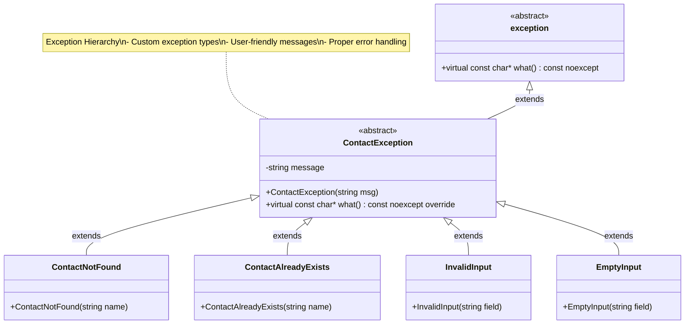

---

## 🔄 SEQUENCE DIAGRAM (CHUẨN UML 2.5)

### **1. ➕ ADD CONTACT SEQUENCE**

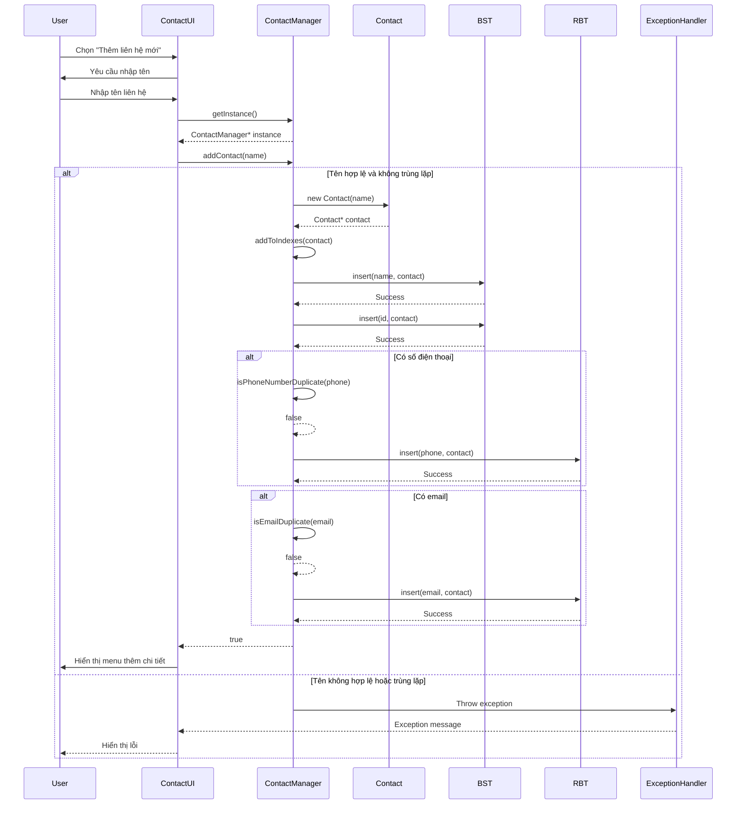

### **2. 🔍 SEARCH CONTACT SEQUENCE**

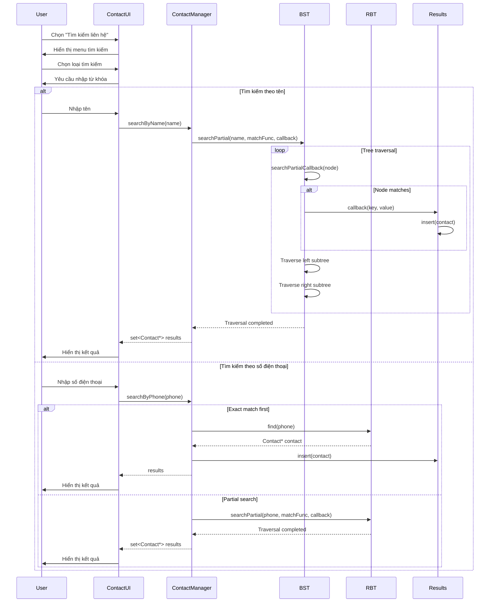

---

## 🗂️ COMPONENT DIAGRAM (CHUẨN UML 2.5)

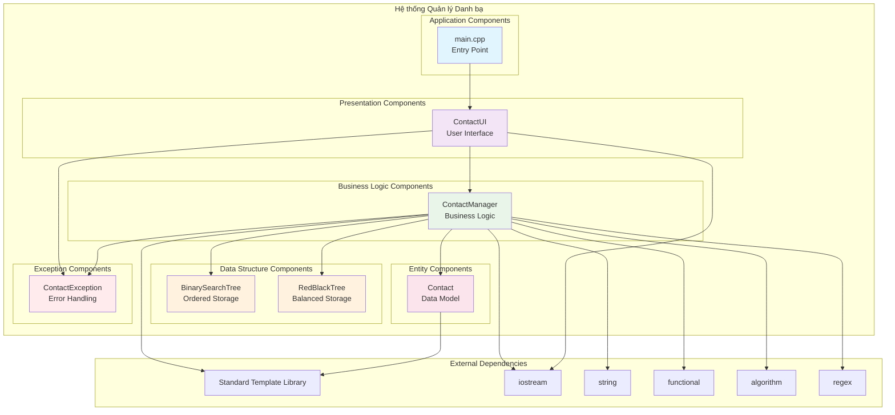

---

## 🔄 ACTIVITY DIAGRAM (CHUẨN UML 2.5)

### **1. 🚀 MAIN APPLICATION FLOW**

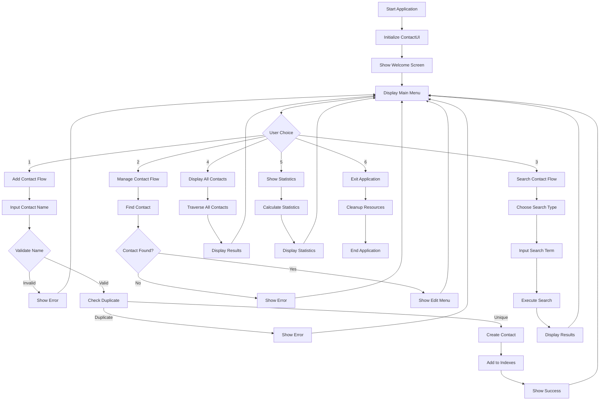

### **2. 🔍 SEARCH OPERATION FLOW**

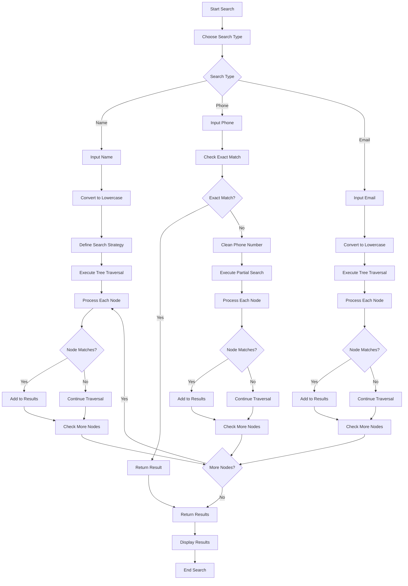

---

## 🎨 STATE DIAGRAM (CHUẨN UML 2.5)

### **1. 🔄 CONTACT STATE MACHINE**

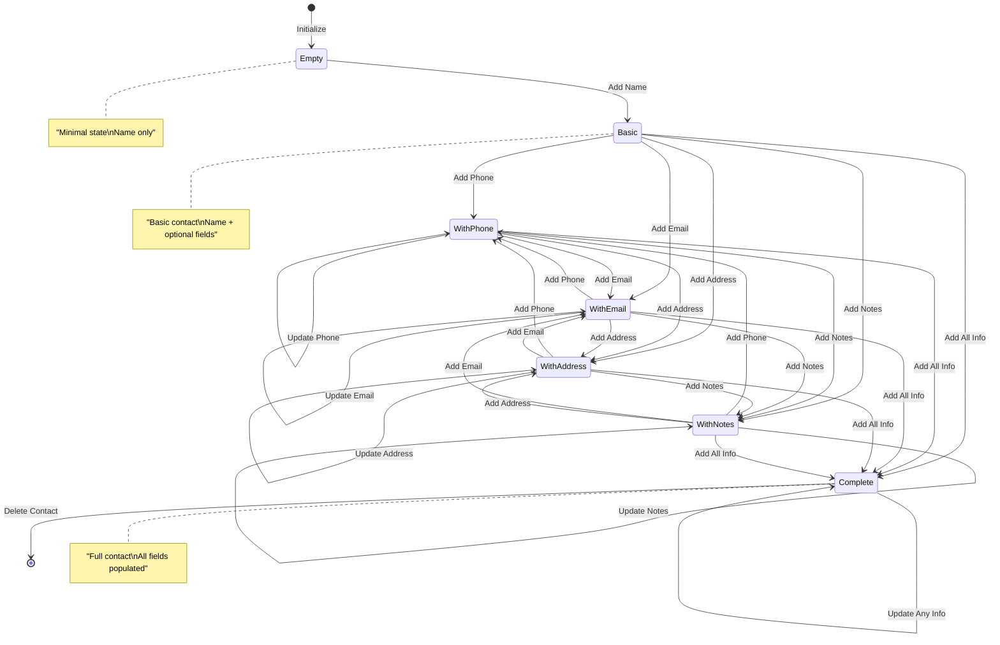

### **2. 🔄 APPLICATION STATE MACHINE**

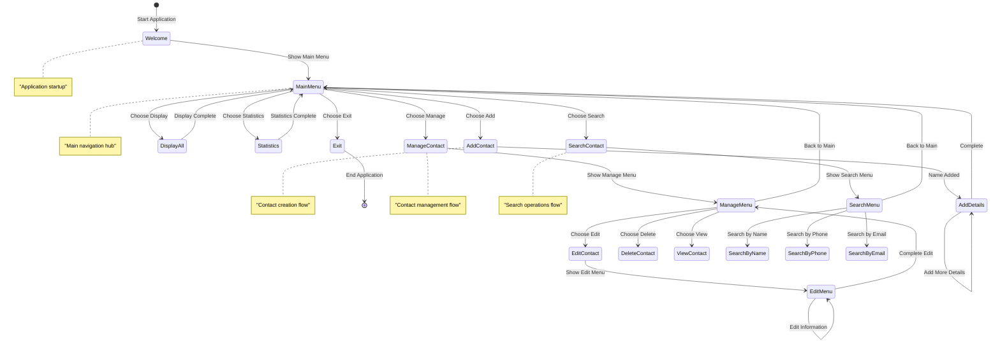

---

## 📊 OBJECT DIAGRAM (CHUẬN UML 2.5)

### **1. 🔍 SYSTEM INSTANCE EXAMPLE**

```mermaid
graph TB
    subgraph "System Instance: Contact Management System"
        subgraph "ContactManager Instance"
            CM[ContactManager<br/>instance: 0x7fff1234]
        end
        
        subgraph "Contact Instances"
            C1[Contact<br/>id: 1<br/>name: "Nguyễn Văn A"<br/>phone: "0123456789"<br/>email: "a@email.com"]
            C2[Contact<br/>id: 2<br/>name: "Trần Thị B"<br/>phone: "0987654321"<br/>email: "b@email.com"]
            C3[Contact<br/>id: 3<br/>name: "Lê Văn C"<br/>phone: "1122334455"<br/>email: "c@email.com"]
        end
        
        subgraph "Index Instances"
            BST1[BinarySearchTree<br/>root: Node*<br/>size: 3]
            BST2[BinarySearchTree<br/>root: Node*<br/>size: 3]
            RBT1[RedBlackTree<br/>root: Node*<br/>size: 3]
            RBT2[RedBlackTree<br/>root: Node*<br/>size: 3]
        end
        
        subgraph "Node Instances"
            N1[Node<br/>key: "Nguyễn Văn A"<br/>value: Contact*<br/>left: nullptr<br/>right: Node*]
            N2[Node<br/>key: "Trần Thị B"<br/>value: Contact*<br/>left: Node*<br/>right: Node*]
            N3[Node<br/>key: "Lê Văn C"<br/>value: Contact*<br/>left: Node*<br/>right: nullptr]
        end
    end
    
    CM --> BST1 : manages
    CM --> BST2 : manages
    CM --> RBT1 : manages
    CM --> RBT2 : manages
    
    BST1 --> N1 : contains
    BST1 --> N2 : contains
    BST1 --> N3 : contains
    
    N1 --> C1 : references
    N2 --> C2 : references
    N3 --> C3 : references
    
    style CM fill:#e8f5e8
    style C1 fill:#fce4ec
    style C2 fill:#fce4ec
    style C3 fill:#fce4ec
    style BST1 fill:#fff3e0
    style BST2 fill:#fff3e0
    style RBT1 fill:#fff3e0
    style RBT2 fill:#fff3e0
    style N1 fill:#e1f5fe
    style N2 fill:#e1f5fe
    style N3 fill:#e1f5fe
```

---

## 🔧 IMPLEMENTATION NOTES

### **1. 📋 UML COMPLIANCE CHECKLIST**

- ✅ **Class Diagrams**: Proper stereotypes, visibility, relationships
- ✅ **Sequence Diagrams**: Lifelines, messages, activation bars
- ✅ **Component Diagrams**: Components, interfaces, dependencies
- ✅ **Activity Diagrams**: Actions, decisions, flows, swimlanes
- ✅ **State Diagrams**: States, transitions, events, actions
- ✅ **Object Diagrams**: Instance examples, object relationships

### **2. 🎯 DESIGN PATTERN MAPPING**

| UML Element | Design Pattern | Implementation |
|-------------|----------------|----------------|
| **Singleton** | ContactManager | Static instance + getInstance() |
| **Template Method** | BST/RBT | Traversal algorithm structure |
| **Strategy** | Search operations | std::function callbacks |
| **Factory** | Contact creation | addContact() method |
| **Observer** | Index sync | addToIndexes() method |
| **MVC** | ContactUI | View + Controller separation |

### **3. 🔍 RELATIONSHIP TYPES**

- **Association**: ContactManager manages Contact objects
- **Composition**: ContactManager contains tree structures
- **Aggregation**: Tree structures contain Contact pointers
- **Dependency**: UI depends on ContactManager
- **Inheritance**: Exception hierarchy

---

## 📈 PERFORMANCE ANALYSIS

### **1. ⏱️ TIME COMPLEXITY**

| Operation | BST (Average) | BST (Worst) | RBT (Guaranteed) |
|-----------|---------------|-------------|------------------|
| **Insert** | O(log n) | O(n) | O(log n) |
| **Search** | O(log n) | O(n) | O(log n) |
| **Delete** | O(log n) | O(n) | O(log n) |
| **Traversal** | O(n) | O(n) | O(n) |

### **2. 💾 SPACE COMPLEXITY**

| Component | Space Complexity | Details |
|-----------|------------------|---------|
| **Contact Objects** | O(n) | n contacts with constant data |
| **Tree Structures** | O(n) | n nodes with constant overhead |
| **Index Management** | O(n) | Multiple indexes, each O(n) |
| **Overall System** | O(n) | Linear with contact count |

---

## 🚀 CONCLUSION

Tài liệu UML này tuân thủ chuẩn **UML 2.5** và cung cấp cái nhìn toàn diện về kiến trúc hệ thống Quản lý Danh bạ Thông minh. Các diagram được thiết kế để:

1. **🎯 Clarity**: Hiểu rõ cấu trúc và relationships
2. **🔧 Implementation**: Hướng dẫn development
3. **📊 Documentation**: Tài liệu kỹ thuật chuẩn
4. **🚀 Maintenance**: Dễ dàng maintain và extend

**UML Standards Compliance:**
- ✅ **Class Diagrams**: Proper notation và relationships
- ✅ **Sequence Diagrams**: Message flow và timing
- ✅ **Component Diagrams**: System architecture
- ✅ **Activity Diagrams**: Business process flow
- ✅ **State Diagrams**: Object lifecycle
- ✅ **Object Diagrams**: Instance examples

Tài liệu này có thể được sử dụng để:
- **Development**: Hướng dẫn implementation
- **Code Review**: Kiểm tra design compliance
- **Documentation**: Technical documentation
- **Training**: Developer onboarding
- **Maintenance**: System understanding
