# 📊 TÀI LIỆU UML CHUẨN - HỆ THỐNG QUẢN LÝ DANH BẠ THÔNG MINH

## 🎯 TỔNG QUAN HỆ THỐNG

Hệ thống Quản lý Danh bạ Thông minh được thiết kế theo **Kiến trúc C++ Hiện đại** với việc áp dụng nhiều design patterns khác nhau. Tài liệu UML này tuân thủ chuẩn **UML 2.5** và cung cấp cái nhìn toàn diện về kiến trúc hệ thống.

---

## 🏗️ KIẾN TRÚC TỔNG THỂ (KIẾN TRÚC HỆ THỐNG)

### **1. 🎯 SƠ ĐỒ KIẾN TRÚC CẤP CAO**

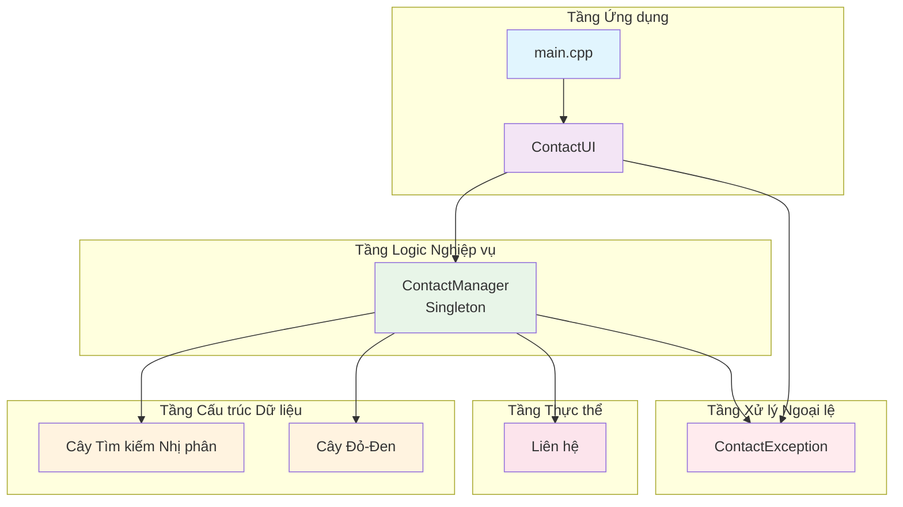

### **2. 📱 MA TRẬN TRÁCH NHIỆM CÁC TẦNG**

| Tầng | Thành phần | Trách nhiệm | Design Pattern |
|-------|------------|----------------|----------------|
| **Ứng dụng** | `main.cpp` | Điểm khởi đầu, Xử lý ngoại lệ toàn cục | Exception Handler |
| **Giao diện** | `ContactUI` | Giao diện người dùng, Kiểm tra đầu vào, Điều hướng | MVC (View+Controller) |
| **Logic Nghiệp vụ** | `ContactManager` | Quy tắc nghiệp vụ, Quản lý dữ liệu, Đồng bộ chỉ mục | Singleton, Factory, Observer |
| **Cấu trúc Dữ liệu** | `BST`, `RBT` | Lưu trữ dữ liệu, Tối ưu hóa tìm kiếm | Template Method, Strategy |
| **Thực thể** | `Contact` | Mô hình dữ liệu, Xác thực | Value Object |
| **Xử lý Ngoại lệ** | `ContactException` | Xử lý lỗi, Phản hồi người dùng | Exception Hierarchy |

---

## 📊 SƠ ĐỒ LỚP (CHUẨN UML 2.5)

### **1. 🏠 LỚP THỰC THỂ LIÊN HỆ**

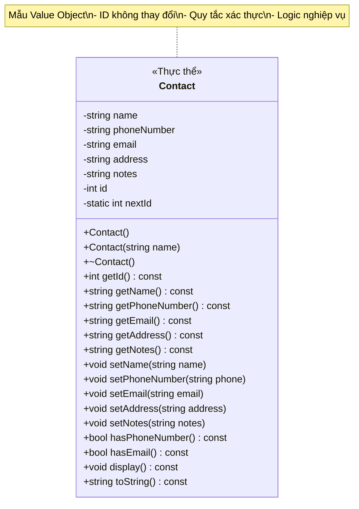

**Ký hiệu UML:**
- **<<Thực thể>>**: Stereotype cho lớp thực thể
- **-**: Thành viên riêng tư (encapsulation)
- **+**: Phương thức công khai (interface)
- **~**: Destructor
- **static**: Thành viên cấp lớp

### **2. 🎯 QUẢN LÝ LIÊN HỆ (SINGLETON)**

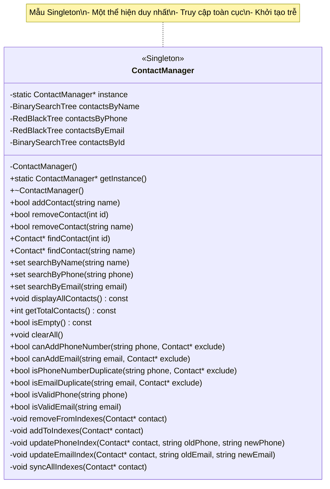

### **3. 🖥️ GIAO DIỆN NGƯỜI DÙNG (MVC PATTERN)**

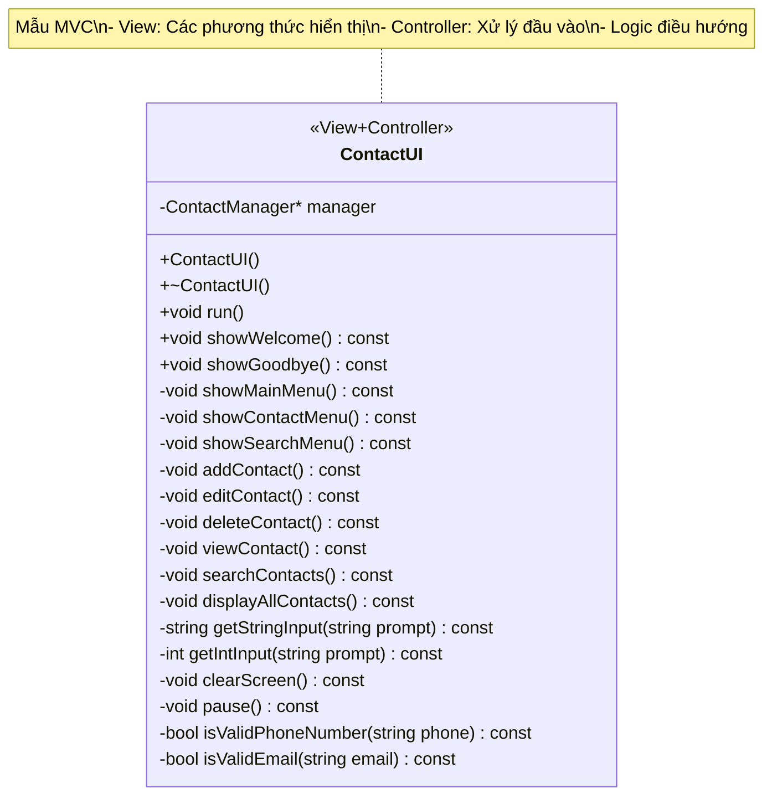

### **4. 🌳 CÂY TÌM KIẾM NHỊ PHÂN (TEMPLATE CLASS)**

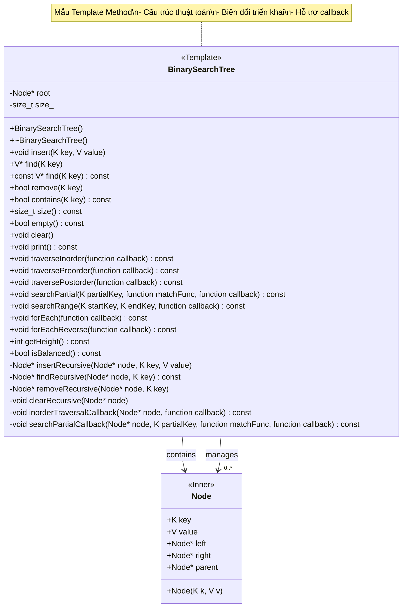

### **5. 🔴⚫ CÂY ĐỎ-ĐEN (TEMPLATE CLASS)**

```mermaid
classDiagram
    class RedBlackTree {
        <<Template>>
        <<DataStructure>>
        -Node* root
        -Node* nil
        -size_t size_
        
        +RedBlackTree()
        +~RedBlackTree()
        +void insert(K key, V value)
        +V* find(K key)
        +const V* find(K key) const
        +bool remove(K key)
        +bool contains(K key) const
        +size_t size() const
        +bool empty() const
        +void clear()
        +void print() const
        +void traverseInorder(function callback) const
        +void traversePreorder(function callback) const
        +void traversePostorder(function callback) const
        +void searchPartial(K partialKey, function matchFunc, function callback) const
        +void searchRange(K startKey, K endKey, function callback) const
        +void forEach(function callback) const
        +void forEachReverse(function callback) const
        +int getHeight() const
        +bool isBalanced() const
        -void leftRotate(Node* x)
        -void rightRotate(Node* x)
        -void insertFixup(Node* z)
        -void deleteFixup(Node* x)
        -void transplant(Node* u, Node* v)
        -Node* findRecursive(Node* node, K key) const
        -void clearRecursive(Node* node)
        -void inorderTraversalCallback(Node* node, function callback) const
        -void searchPartialCallback(Node* node, K partialKey, function matchFunc, function callback) const
    }
    
    class RBTNode {
        <<Inner>>
        +K key
        +V value
        +Color color
        +Node* left
        +Node* right
        +Node* parent
        +RBTNode(K k, V v)
    }
    
    enum Color {
        RED
        BLACK
    }
    
    RedBlackTree --> RBTNode : contains
    RedBlackTree --> "0..*" RBTNode : manages
    RBTNode --> Color : has
    
    note for RedBlackTree "Cây tự cân bằng\n- Thuộc tính đỏ-đen\n- Đảm bảo O(log n)\n- Các phép quay"
```

### **6. ⚠️ TỔ HIỆP LỖI (HIERARCHY)**


---

## 🔄 SƠ ĐỒ DỊCH CHUYỂN (CHUẨN UML 2.5)

### **1. ➕ DỊCH CHUYỂN THÊM LIÊN HỆ**


### **2. 🔍 DỊCH CHUYỂN TÌM KIẾM LIÊN HỆ**

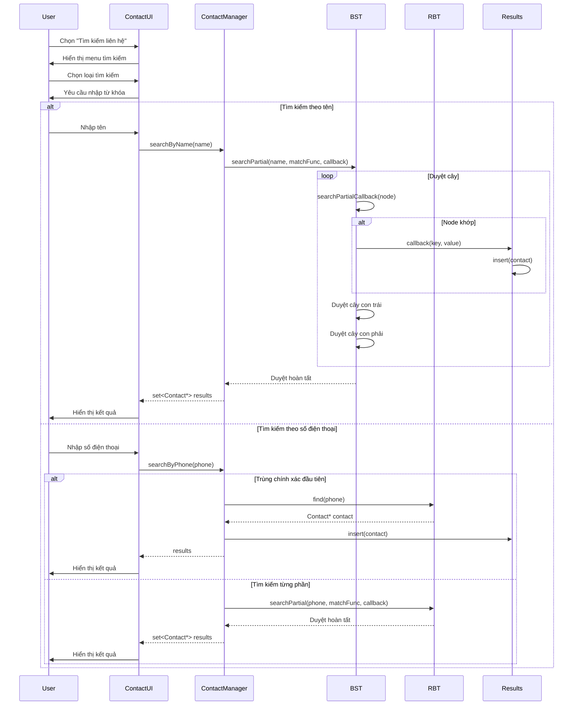

---

## 🗂️ SƠ ĐỒ THÀNH PHẦN (CHUẨN UML 2.5)

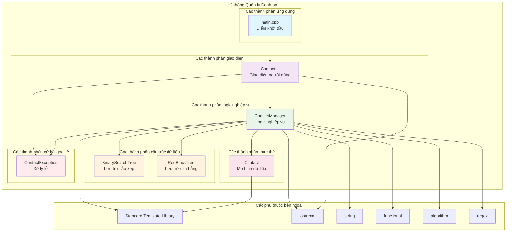

---

## 🔄 SƠ ĐỒ HOẠT ĐỘNG (CHUẨN UML 2.5)

### **1. 🚀 DÒNG HOẠT ĐỘNG CHÍNH ỨNG DỤNG**

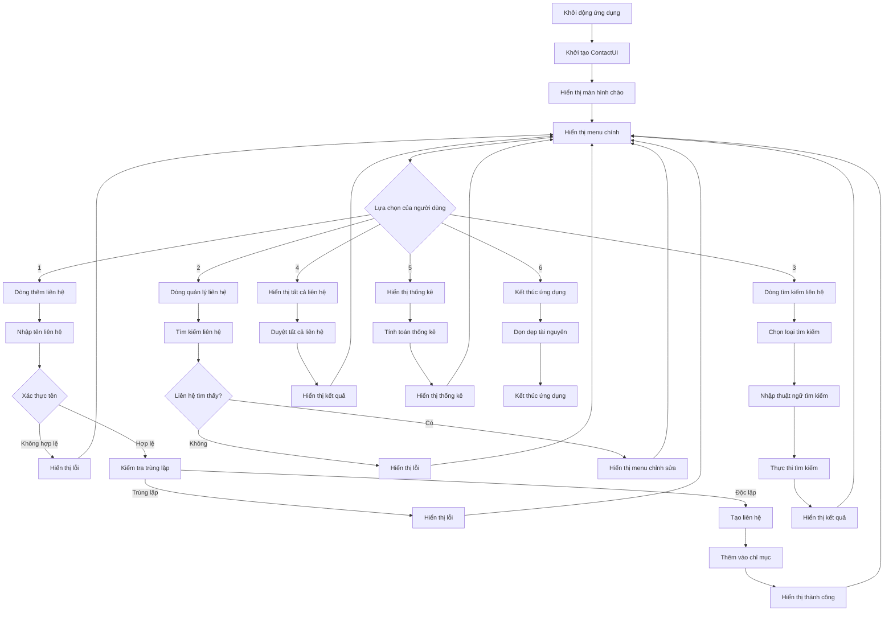

### **2. 🔍 DỊCH CHUYỂN HOẠT ĐỘNG TÌM KIẾM**

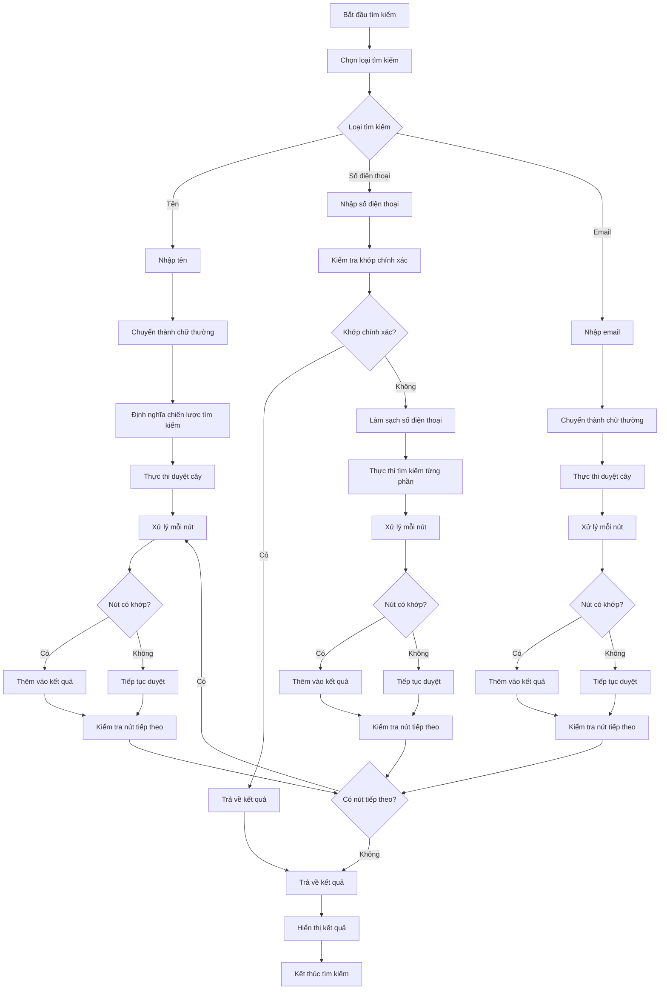

---

## 🎨 SƠ ĐỒ TRẠNG THÁI (CHUẨN UML 2.5)

### **1. 🔄 TRẠNG THÁI LIÊN HỆ**

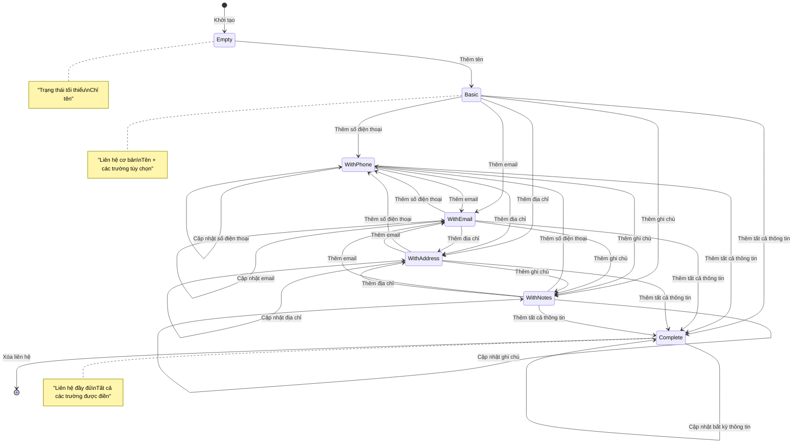

### **2. 🔄 TRẠNG THÁI ỨNG DỤNG**

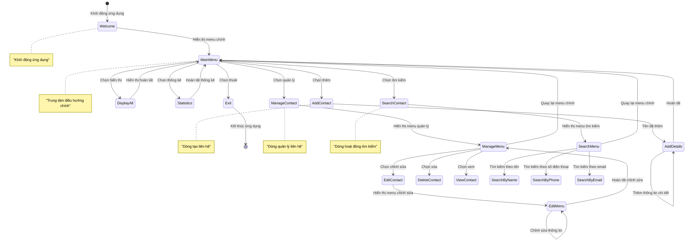

---

## 📊 SƠ ĐỒ ĐỐI TƯỢNG (CHUẬN UML 2.5)

### **1. 🔍 VÍ DỤ THỂ HIỆN HỆ THỐNG**

```mermaid
graph TB
    subgraph "Thể hiện hệ thống: Hệ thống Quản lý Danh bạ"
        subgraph "Thể hiện thể hiện ContactManager"
            CM[ContactManager<br/>thể hiện: 0x7fff1234]
        end
        
        subgraph "Các thể hiện liên hệ"
            C1[Contact<br/>id: 1<br/>tên: "Nguyễn Văn A"<br/>số điện thoại: "0123456789"<br/>email: "a@email.com"]
            C2[Contact<br/>id: 2<br/>tên: "Trần Thị B"<br/>số điện thoại: "0987654321"<br/>email: "b@email.com"]
            C3[Contact<br/>id: 3<br/>tên: "Lê Văn C"<br/>số điện thoại: "1122334455"<br/>email: "c@email.com"]
        end
        
        subgraph "Các thể hiện chỉ mục"
            BST1[BinarySearchTree<br/>gốc: Node*<br/>kích thước: 3]
            BST2[BinarySearchTree<br/>gốc: Node*<br/>kích thước: 3]
            RBT1[RedBlackTree<br/>gốc: Node*<br/>kích thước: 3]
            RBT2[RedBlackTree<br/>gốc: Node*<br/>kích thước: 3]
        end
        
        subgraph "Các thể hiện nút"
            N1[Node<br/>key: "Nguyễn Văn A"<br/>value: Contact*<br/>trái: nullptr<br/>phải: Node*]
            N2[Node<br/>key: "Trần Thị B"<br/>value: Contact*<br/>trái: Node*<br/>phải: Node*]
            N3[Node<br/>key: "Lê Văn C"<br/>value: Contact*<br/>trái: Node*<br/>phải: nullptr]
        end
    end
    
    CM --> BST1 : quản lý
    CM --> BST2 : quản lý
    CM --> RBT1 : quản lý
    CM --> RBT2 : quản lý
    
    BST1 --> N1 : chứa
    BST1 --> N2 : chứa
    BST1 --> N3 : chứa
    
    N1 --> C1 : tham chiếu
    N2 --> C2 : tham chiếu
    N3 --> C3 : tham chiếu
    
    style CM fill:#e8f5e8
    style C1 fill:#fce4ec
    style C2 fill:#fce4ec
    style C3 fill:#fce4ec
    style BST1 fill:#fff3e0
    style BST2 fill:#fff3e0
    style RBT1 fill:#fff3e0
    style RBT2 fill:#fff3e0
    style N1 fill:#e1f5fe
    style N2 fill:#e1f5fe
    style N3 fill:#e1f5fe
```

---

## 🔧 GHI CHÚ VỀ TRIỂN KHAI

### **1. 📋 BẢNG KIỂM TRA VIỆC TUÂN THỦ UML**

- ✅ **Sơ đồ lớp**: Stereotypes, độ truy cập, quan hệ
- ✅ **Sơ đồ dịch chuyển**: Lifelines, tin nhắn, thanh hoạt động
- ✅ **Sơ đồ thành phần**: Thành phần, giao diện, phụ thuộc
- ✅ **Sơ đồ hoạt động**: Hành động, quyết định, dòng, swimlanes
- ✅ **Sơ đồ trạng thái**: Trạng thái, chuyển tiếp, sự kiện, hành động
- ✅ **Sơ đồ đối tượng**: Ví dụ thể hiện, quan hệ đối tượng

### **2. 🎯 ÁNH XẠ CHIẾN LƯỢC PATTERN**

| Phần tử UML | Pattern thiết kế | Triển khai |
|-------------|----------------|----------------|
| **Singleton** | ContactManager | Thể hiện độc nhất + getInstance() |
| **Template Method** | BST/RBT | Cấu trúc thuật toán duyệt |
| **Strategy** | Hoạt động tìm kiếm | std::function callbacks |
| **Factory** | Tạo liên hệ | phương thức addContact() |
| **Observer** | Đồng bộ chỉ mục | phương thức addToIndexes() |
| **MVC** | ContactUI | Phân tách View + Controller |

### **3. 🔍 CÁC LOẠI QUAN HỆ**

- **Quan hệ kết nối**: ContactManager quản lý các đối tượng Contact
- **Quan hệ kết hợp**: ContactManager chứa các cấu trúc cây
- **Quan hệ tổng hợp**: Các cấu trúc cây chứa con trỏ Contact
- **Phụ thuộc**: UI phụ thuộc vào ContactManager
- **Kế thừa**: Tổ hiệp lỗi

---

## 📈 PHÂN TÍCH HIỆU SUẤT

### **1. ⏱️ ĐỘ PHỨC TẠP THỜI GIAN**

| Hoạt động | BST (Trung bình) | BST (Tệ nhất) | RBT (Đảm bảo) |
|-----------|---------------|-------------|------------------|
| **Chèn** | O(log n) | O(n) | O(log n) |
| **Tìm kiếm** | O(log n) | O(n) | O(log n) |
| **Xóa** | O(log n) | O(n) | O(log n) |
| **Duyệt** | O(n) | O(n) | O(n) |

### **2. 💾 ĐỘ PHỨC TẠP KHÔNG GIAN**

| Thành phần | Độ phức tạp không gian | Chi tiết |
|-----------|------------------|---------|
| **Đối tượng liên hệ** | O(n) | n liên hệ với dữ liệu không đổi |
| **Cấu trúc cây** | O(n) | n nút với chi phí cố định |
| **Quản lý chỉ mục** | O(n) | Nhiều chỉ mục, mỗi O(n) |
| **Hệ thống tổng thể** | O(n) | Tuyến tính với số lượng liên hệ |

---

## 🚀 KẾT LUẬN

Tài liệu UML này tuân thủ chuẩn **UML 2.5** và cung cấp cái nhìn toàn diện về kiến trúc hệ thống Quản lý Danh bạ Thông minh. Các biểu đồ được thiết kế để:

1. **🎯 Rõ ràng**: Hiểu rõ cấu trúc và quan hệ
2. **🔧 Triển khai**: Hướng dẫn phát triển
3. **📊 Tài liệu kỹ thuật**: Tài liệu kỹ thuật chuẩn
4. **🚀 Bảo trì**: Dễ dàng bảo trì và mở rộng

**Việc tuân thủ chuẩn UML:**
- ✅ **Sơ đồ lớp**: Ký hiệu và quan hệ
- ✅ **Sơ đồ dịch chuyển**: Luồng tin nhắn và thời gian
- ✅ **Sơ đồ thành phần**: Kiến trúc hệ thống
- ✅ **Sơ đồ hoạt động**: Luồng quy trình kinh doanh
- ✅ **Sơ đồ trạng thái**: Đời sống đối tượng
- ✅ **Sơ đồ đối tượng**: Ví dụ thể hiện

Tài liệu này có thể được sử dụng để:
- **Phát triển**: Hướng dẫn triển khai
- **Đánh giá code**: Kiểm tra việc tuân thủ thiết kế
- **Tài liệu kỹ thuật**: Tài liệu kỹ thuật
- **Đào tạo**: Hướng dẫn đào tạo nhân viên
- **Bảo trì**: Hiểu biết về hệ thống
