#  TÀI LIỆU UML CHUẨN - HỆ THỐNG QUẢN LÝ DANH BẠ THÔNG MINH

##  TỔNG QUAN HỆ THỐNG

Hệ thống Quản lý Danh bạ Thông minh được thiết kế theo **Kiến trúc C++ Hiện đại** với việc áp dụng nhiều design patterns khác nhau. Tài liệu UML này tuân thủ chuẩn **UML 2.5** và cung cấp cái nhìn toàn diện về kiến trúc hệ thống.

---

##  KIẾN TRÚC TỔNG THỂ (KIẾN TRÚC HỆ THỐNG)

### **1.  SƠ ĐỒ KIẾN TRÚC CẤP CAO**

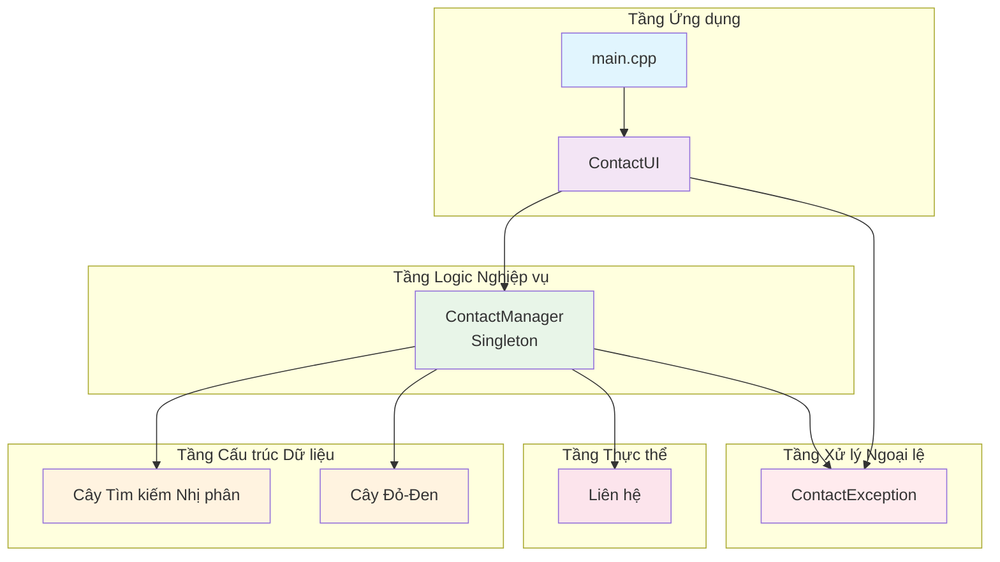
```mermaid
graph TB
    subgraph "Tầng Ứng dụng"
        MAIN[main.cpp]
        UI[ContactUI]
    end
    
    subgraph "Tầng Logic Nghiệp vụ"
        CM[ContactManager<br/>Singleton]
    end
    
    subgraph "Tầng Cấu trúc Dữ liệu"
        BST[Cây Tìm kiếm Nhị phân]
        RBT[Cây Đỏ-Đen]
    end
    
    subgraph "Tầng Thực thể"
        CONTACT[Liên hệ]
    end
    
    subgraph "Tầng Xử lý Ngoại lệ"
        EX[ContactException]
    end
    
    MAIN --> UI
    UI --> CM
    CM --> BST
    CM --> RBT
    CM --> CONTACT
    CM --> EX
    UI --> EX
    
    style MAIN fill:#e1f5fe
    style UI fill:#f3e5f5
    style CM fill:#e8f5e8
    style BST fill:#fff3e0
    style RBT fill:#fff3e0
    style CONTACT fill:#fce4ec
    style EX fill:#ffebee
```

### **2.  MA TRẬN TRÁCH NHIỆM CÁC TẦNG**

| Tầng | Thành phần | Trách nhiệm | Design Pattern |
|-------|------------|----------------|----------------|
| **Ứng dụng** | `main.cpp` | Điểm khởi đầu, Xử lý ngoại lệ toàn cục | Exception Handler |
| **Giao diện** | `ContactUI` | Giao diện người dùng, Kiểm tra đầu vào, Điều hướng | MVC (View+Controller) |
| **Logic Nghiệp vụ** | `ContactManager` | Quy tắc nghiệp vụ, Quản lý dữ liệu, Đồng bộ chỉ mục | Singleton, Factory, Observer |
| **Cấu trúc Dữ liệu** | `BST`, `RBT` | Lưu trữ dữ liệu, Tối ưu hóa tìm kiếm | Template Method, Strategy |
| **Thực thể** | `Contact` | Mô hình dữ liệu, Xác thực | Value Object |
| **Xử lý Ngoại lệ** | `ContactException` | Xử lý lỗi, Phản hồi người dùng | Exception Hierarchy |

---

## 📊 SƠ ĐỒ LỚP (CHUẨN UML 2.5)

### **1.  LỚP THỰC THỂ LIÊN HỆ**

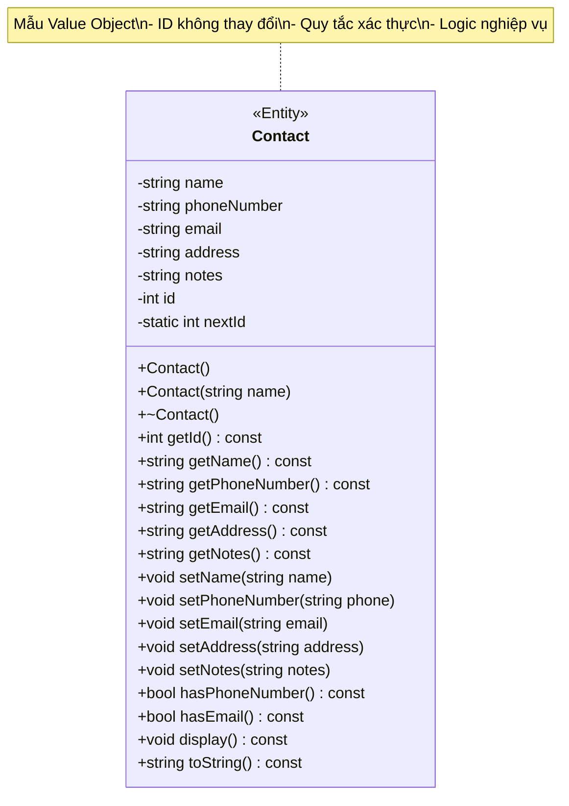
```mermaid
classDiagram
    class Contact {
        <<Entity>>
        -string name
        -string phoneNumber
        -string email
        -string address
        -string notes
        -int id
        -static int nextId
        
        +Contact()
        +Contact(string name)
        +~Contact()
        +int getId() const
        +string getName() const
        +string getPhoneNumber() const
        +string getEmail() const
        +string getAddress() const
        +string getNotes() const
        +void setName(string name)
        +void setPhoneNumber(string phone)
        +void setEmail(string email)
        +void setAddress(string address)
        +void setNotes(string notes)
        +bool hasPhoneNumber() const
        +bool hasEmail() const
        +void display() const
        +string toString() const
    }
    
    note for Contact "Mẫu Value Object\n- ID không thay đổi\n- Quy tắc xác thực\n- Logic nghiệp vụ"
```

**Ký hiệu UML:**
- **<<Thực thể>>**: Stereotype cho lớp thực thể
- **-**: Thành viên riêng tư (encapsulation)
- **+**: Phương thức công khai (interface)
- **~**: Destructor
- **static**: Thành viên cấp lớp

### **2.  QUẢN LÝ LIÊN HỆ (SINGLETON)**

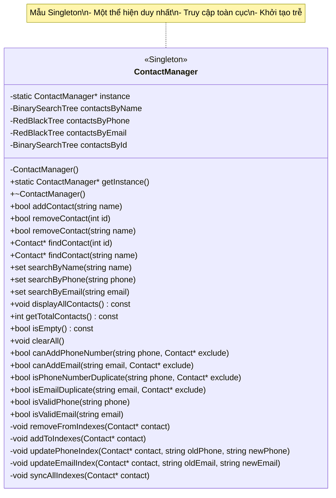
```mermaid
classDiagram
    class ContactManager {
        <<Singleton>>
        -static ContactManager* instance
        -BinarySearchTree<string, Contact*> contactsByName
        -RedBlackTree<string, Contact*> contactsByPhone
        -RedBlackTree<string, Contact*> contactsByEmail
        -BinarySearchTree<int, Contact*> contactsById
        
        -ContactManager()
        +static ContactManager* getInstance()
        +~ContactManager()
        +bool addContact(string name)
        +bool removeContact(int id)
        +bool removeContact(string name)
        +Contact* findContact(int id)
        +Contact* findContact(string name)
        +set<Contact*> searchByName(string name)
        +set<Contact*> searchByPhone(string phone)
        +set<Contact*> searchByEmail(string email)
        +void displayAllContacts() const
        +int getTotalContacts() const
        +bool isEmpty() const
        +void clearAll()
        +bool canAddPhoneNumber(string phone, Contact* exclude)
        +bool canAddEmail(string email, Contact* exclude)
        +bool isPhoneNumberDuplicate(string phone, Contact* exclude)
        +bool isEmailDuplicate(string email, Contact* exclude)
        +bool isValidPhone(string phone)
        +bool isValidEmail(string email)
        -void removeFromIndexes(Contact* contact)
        -void addToIndexes(Contact* contact)
        -void updatePhoneIndex(Contact* contact, string oldPhone, string newPhone)
        -void updateEmailIndex(Contact* contact, string oldEmail, string newEmail)
        -void syncAllIndexes(Contact* contact)
    }
    
    note for ContactManager "Mẫu Singleton\n- Một thể hiện duy nhất\n- Truy cập toàn cục\n- Khởi tạo trễ"
```

### **3.  GIAO DIỆN NGƯỜI DÙNG (MVC PATTERN)**

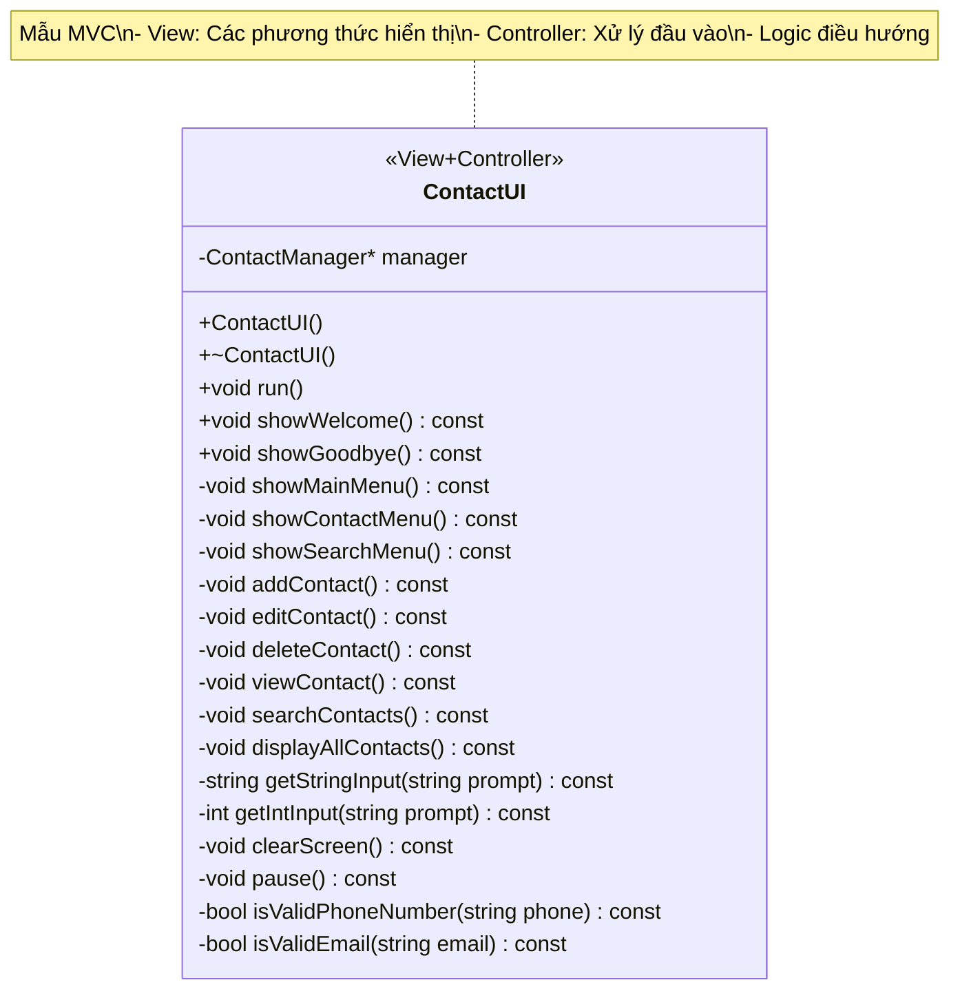
```mermaid
classDiagram
    class ContactUI {
        <<View+Controller>>
        -ContactManager* manager
        
        +ContactUI()
        +~ContactUI()
        +void run()
        +void showWelcome() const
        +void showGoodbye() const
        -void showMainMenu() const
        -void showContactMenu() const
        -void showSearchMenu() const
        -void addContact() const
        -void editContact() const
        -void deleteContact() const
        -void viewContact() const
        -void searchContacts() const
        -void displayAllContacts() const
        -string getStringInput(string prompt) const
        -int getIntInput(string prompt) const
        -void clearScreen() const
        -void pause() const
        -bool isValidPhoneNumber(string phone) const
        -bool isValidEmail(string email) const
    }
    
    note for ContactUI "Mẫu MVC\n- View: Các phương thức hiển thị\n- Controller: Xử lý đầu vào\n- Logic điều hướng"
```

### **4.  CÂY TÌM KIẾM NHỊ PHÂN (TEMPLATE CLASS)**

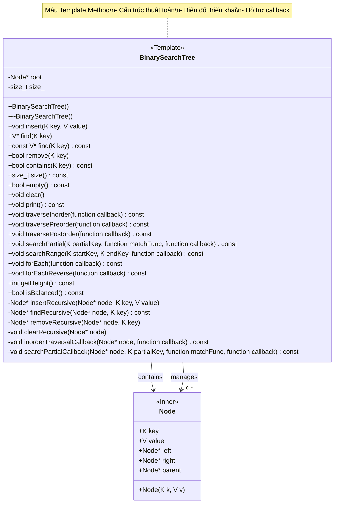
```mermaid
classDiagram
    class BinarySearchTree {
        <<Template>>
        <<DataStructure>>
        -Node* root
        -size_t size_
        
        +BinarySearchTree()
        +~BinarySearchTree()
        +void insert(K key, V value)
        +V* find(K key)
        +const V* find(K key) const
        +bool remove(K key)
        +bool contains(K key) const
        +size_t size() const
        +bool empty() const
        +void clear()
        +void print() const
        +void traverseInorder(function callback) const
        +void traversePreorder(function callback) const
        +void traversePostorder(function callback) const
        +void searchPartial(K partialKey, function matchFunc, function callback) const
        +void searchRange(K startKey, K endKey, function callback) const
        +void forEach(function callback) const
        +void forEachReverse(function callback) const
        +int getHeight() const
        +bool isBalanced() const
        -Node* insertRecursive(Node* node, K key, V value)
        -Node* findRecursive(Node* node, K key) const
        -Node* removeRecursive(Node* node, K key)
        -void clearRecursive(Node* node)
        -void inorderTraversalCallback(Node* node, function callback) const
        -void searchPartialCallback(Node* node, K partialKey, function matchFunc, function callback) const
    }
    
    class Node {
        <<Inner>>
        +K key
        +V value
        +Node* left
        +Node* right
        +Node* parent
        +Node(K k, V v)
    }
    
    BinarySearchTree --> Node : contains
    BinarySearchTree --> "0..*" Node : manages
    
    note for BinarySearchTree "Mẫu Template Method\n- Cấu trúc thuật toán\n- Biến đổi triển khai\n- Hỗ trợ callback"
```

### **5.  CÂY ĐỎ-ĐEN (TEMPLATE CLASS)**

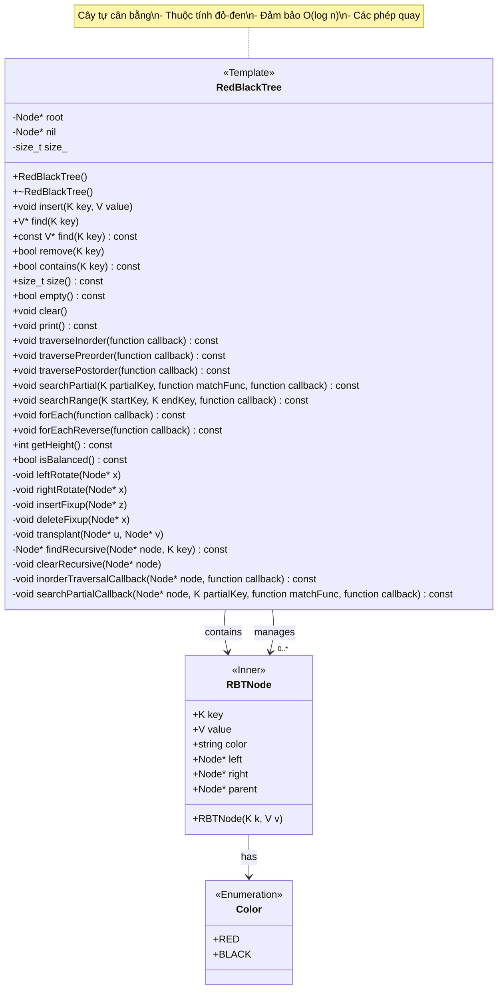
```mermaid
classDiagram
    class RedBlackTree {
        <<Template>>
        <<DataStructure>>
        -Node* root
        -Node* nil
        -size_t size_
        
        +RedBlackTree()
        +~RedBlackTree()
        +void insert(K key, V value)
        +V* find(K key)
        +const V* find(K key) const
        +bool remove(K key)
        +bool contains(K key) const
        +size_t size() const
        +bool empty() const
        +void clear()
        +void print() const
        +void traverseInorder(function callback) const
        +void traversePreorder(function callback) const
        +void traversePostorder(function callback) const
        +void searchPartial(K partialKey, function matchFunc, function callback) const
        +void searchRange(K startKey, K endKey, function callback) const
        +void forEach(function callback) const
        +void forEachReverse(function callback) const
        +int getHeight() const
        +bool isBalanced() const
        -void leftRotate(Node* x)
        -void rightRotate(Node* x)
        -void insertFixup(Node* z)
        -void deleteFixup(Node* x)
        -void transplant(Node* u, Node* v)
        -Node* findRecursive(Node* node, K key) const
        -void clearRecursive(Node* node)
        -void inorderTraversalCallback(Node* node, function callback) const
        -void searchPartialCallback(Node* node, K partialKey, function matchFunc, function callback) const
    }
    
    class RBTNode {
        <<Inner>>
        +K key
        +V value
        +string color
        +Node* left
        +Node* right
        +Node* parent
        +RBTNode(K k, V v)
    }
    
    class Color {
        <<Enumeration>>
        +RED
        +BLACK
    }
    
    RedBlackTree --> RBTNode : contains
    RedBlackTree --> "0..*" RBTNode : manages
    RBTNode --> Color : has
    
    note for RedBlackTree "Cây tự cân bằng\n- Thuộc tính đỏ-đen\n- Đảm bảo O(log n)\n- Các phép quay"
```

### **6. ⚠️ TỔ HIỆP LỖI (HIERARCHY)**

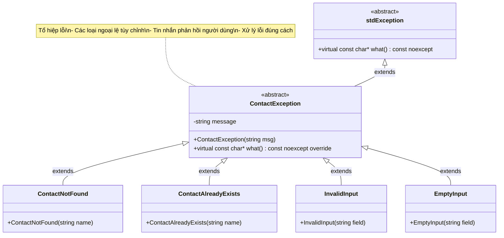
```mermaid
classDiagram
    stdException <|-- ContactException : extends
    ContactException <|-- ContactNotFound : extends
    ContactException <|-- ContactAlreadyExists : extends
    ContactException <|-- InvalidInput : extends
    ContactException <|-- EmptyInput : extends
    
    class stdException {
        <<abstract>>
        +virtual const char* what() const noexcept
    }
    
    class ContactException {
        <<abstract>>
        -string message
        +ContactException(string msg)
        +virtual const char* what() const noexcept override
    }
    
    class ContactNotFound {
        +ContactNotFound(string name)
    }
    
    class ContactAlreadyExists {
        +ContactAlreadyExists(string name)
    }
    
    class InvalidInput {
        +InvalidInput(string field)
    }
    
    class EmptyInput {
        +EmptyInput(string field)
    }
    
    note for ContactException "Tổ hiệp lỗi\n- Các loại ngoại lệ tùy chỉnh\n- Tin nhắn phản hồi người dùng\n- Xử lý lỗi đúng cách"
```

---

## 🔄 SƠ ĐỒ DỊCH CHUYỂN (CHUẨN UML 2.5)

### **1.  DỊCH CHUYỂN THÊM LIÊN HỆ**

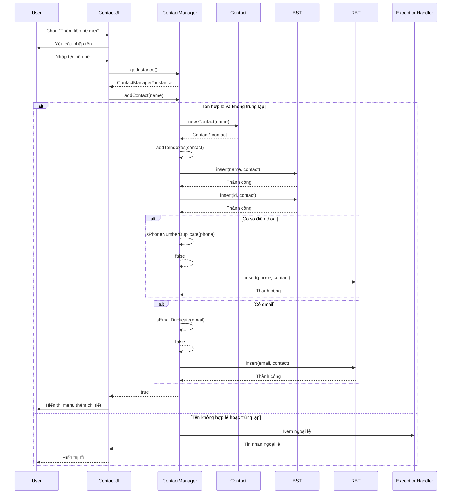
```mermaid
sequenceDiagram
    participant User
    participant ContactUI
    participant ContactManager
    participant Contact
    participant BST
    participant RBT
    participant ExceptionHandler
    
    User->>ContactUI: Chọn "Thêm liên hệ mới"
    ContactUI->>User: Yêu cầu nhập tên
    User->>ContactUI: Nhập tên liên hệ
    ContactUI->>ContactManager: getInstance()
    ContactManager-->>ContactUI: ContactManager* instance
    
    ContactUI->>ContactManager: addContact(name)
    
    alt Tên hợp lệ và không trùng lặp
        ContactManager->>Contact: new Contact(name)
        Contact-->>ContactManager: Contact* contact
        ContactManager->>ContactManager: addToIndexes(contact)
        
        ContactManager->>BST: insert(name, contact)
        BST-->>ContactManager: Thành công
        
        ContactManager->>BST: insert(id, contact)
        BST-->>ContactManager: Thành công
        
        alt Có số điện thoại
            ContactManager->>ContactManager: isPhoneNumberDuplicate(phone)
            ContactManager-->>ContactManager: false
            ContactManager->>RBT: insert(phone, contact)
            RBT-->>ContactManager: Thành công
        end
        
        alt Có email
            ContactManager->>ContactManager: isEmailDuplicate(email)
            ContactManager-->>ContactManager: false
            ContactManager->>RBT: insert(email, contact)
            RBT-->>ContactManager: Thành công
        end
        
        ContactManager-->>ContactUI: true
        ContactUI->>User: Hiển thị menu thêm chi tiết
        
    else Tên không hợp lệ hoặc trùng lặp
        ContactManager->>ExceptionHandler: Ném ngoại lệ
        ExceptionHandler-->>ContactUI: Tin nhắn ngoại lệ
        ContactUI-->>User: Hiển thị lỗi
    end
```

### **2.  DỊCH CHUYỂN TÌM KIẾM LIÊN HỆ**

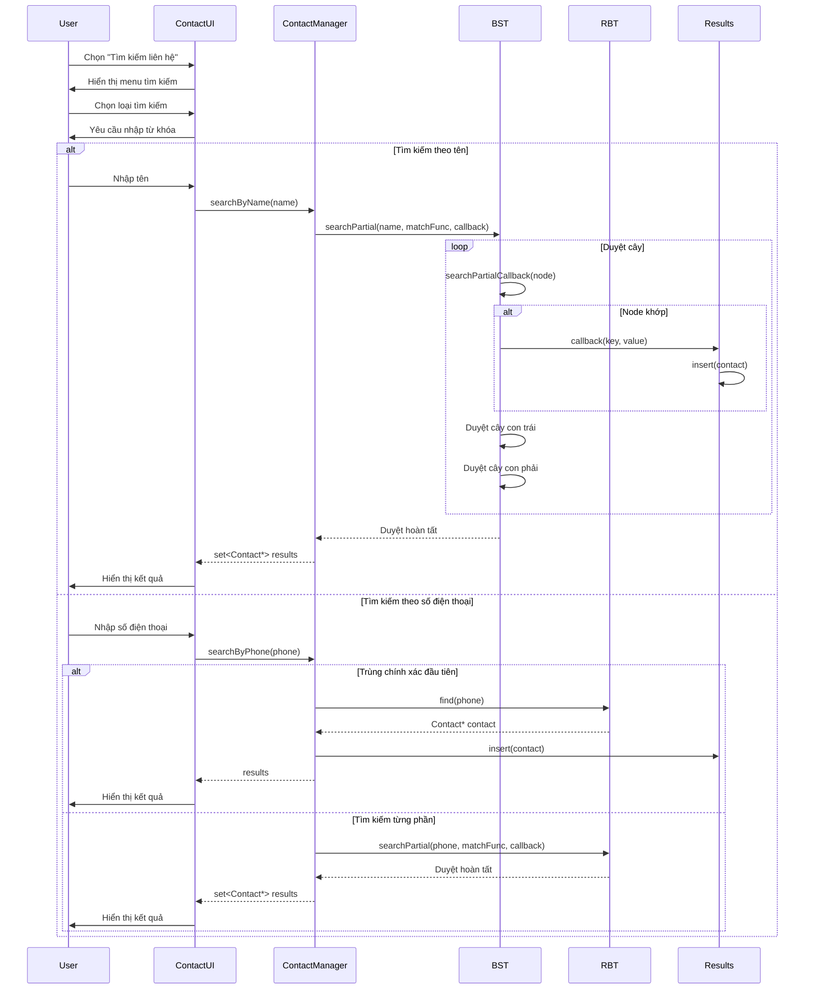
```mermaid
sequenceDiagram
    participant User
    participant ContactUI
    participant ContactManager
    participant BST
    participant RBT
    participant Results
    
    User->>ContactUI: Chọn "Tìm kiếm liên hệ"
    ContactUI->>User: Hiển thị menu tìm kiếm
    User->>ContactUI: Chọn loại tìm kiếm
    ContactUI->>User: Yêu cầu nhập từ khóa
    
    alt Tìm kiếm theo tên
        User->>ContactUI: Nhập tên
        ContactUI->>ContactManager: searchByName(name)
        ContactManager->>BST: searchPartial(name, matchFunc, callback)
        
        loop Duyệt cây
            BST->>BST: searchPartialCallback(node)
            alt Node khớp
                BST->>Results: callback(key, value)
                Results->>Results: insert(contact)
            end
            BST->>BST: Duyệt cây con trái
            BST->>BST: Duyệt cây con phải
        end
        
        BST-->>ContactManager: Duyệt hoàn tất
        ContactManager-->>ContactUI: set<Contact*> results
        ContactUI->>User: Hiển thị kết quả
        
    else Tìm kiếm theo số điện thoại
        User->>ContactUI: Nhập số điện thoại
        ContactUI->>ContactManager: searchByPhone(phone)
        
        alt Trùng chính xác đầu tiên
            ContactManager->>RBT: find(phone)
            RBT-->>ContactManager: Contact* contact
            ContactManager->>Results: insert(contact)
            ContactManager-->>ContactUI: results
            ContactUI->>User: Hiển thị kết quả
        else Tìm kiếm từng phần
            ContactManager->>RBT: searchPartial(phone, matchFunc, callback)
            RBT-->>ContactManager: Duyệt hoàn tất
            ContactManager-->>ContactUI: set<Contact*> results
            ContactUI->>User: Hiển thị kết quả
        end
    end
```

---

##  SƠ ĐỒ THÀNH PHẦN (CHUẨN UML 2.5)

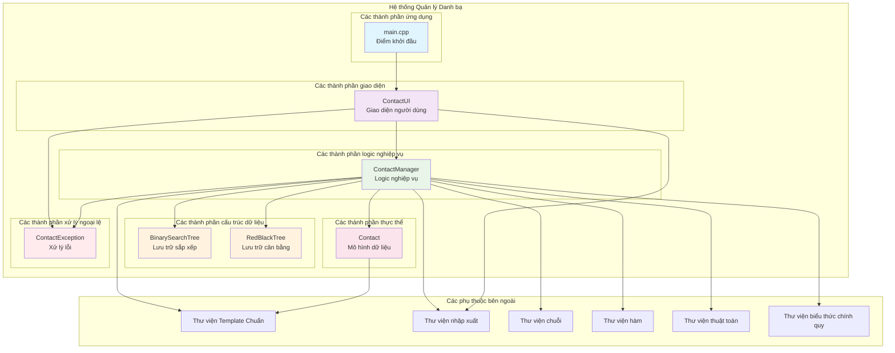
```mermaid
graph TB
    subgraph "Hệ thống Quản lý Danh bạ"
        subgraph "Các thành phần ứng dụng"
            MAIN[main.cpp<br/>Điểm khởi đầu]
        end
        
        subgraph "Các thành phần giao diện"
            UI[ContactUI<br/>Giao diện người dùng]
        end
        
        subgraph "Các thành phần logic nghiệp vụ"
            CM[ContactManager<br/>Logic nghiệp vụ]
        end
        
        subgraph "Các thành phần cấu trúc dữ liệu"
            BST[BinarySearchTree<br/>Lưu trữ sắp xếp]
            RBT[RedBlackTree<br/>Lưu trữ cân bằng]
        end
        
        subgraph "Các thành phần thực thể"
            C[Contact<br/>Mô hình dữ liệu]
        end
        
        subgraph "Các thành phần xử lý ngoại lệ"
            EX[ContactException<br/>Xử lý lỗi]
        end
    end
    
    subgraph "Các phụ thuộc bên ngoài"
        STL[Thư viện Template Chuẩn]
        IO[Thư viện nhập xuất]
        STRING[Thư viện chuỗi]
        FUNCTIONAL[Thư viện hàm]
        ALGORITHM[Thư viện thuật toán]
        REGEX[Thư viện biểu thức chính quy]
    end
    
    MAIN --> UI
    UI --> CM
    CM --> BST
    CM --> RBT
    CM --> C
    CM --> EX
    UI --> EX
    
    C --> STL
    CM --> STL
    UI --> IO
    CM --> IO
    CM --> STRING
    CM --> FUNCTIONAL
    CM --> ALGORITHM
    CM --> REGEX
    
    style MAIN fill:#e1f5fe
    style UI fill:#f3e5f5
    style CM fill:#e8f5e8
    style BST fill:#fff3e0
    style RBT fill:#fff3e0
    style C fill:#fce4ec
    style EX fill:#ffebee
```

---

##  SƠ ĐỒ HOẠT ĐỘNG (CHUẨN UML 2.5)

### **1.  DÒNG HOẠT ĐỘNG CHÍNH ỨNG DỤNG**

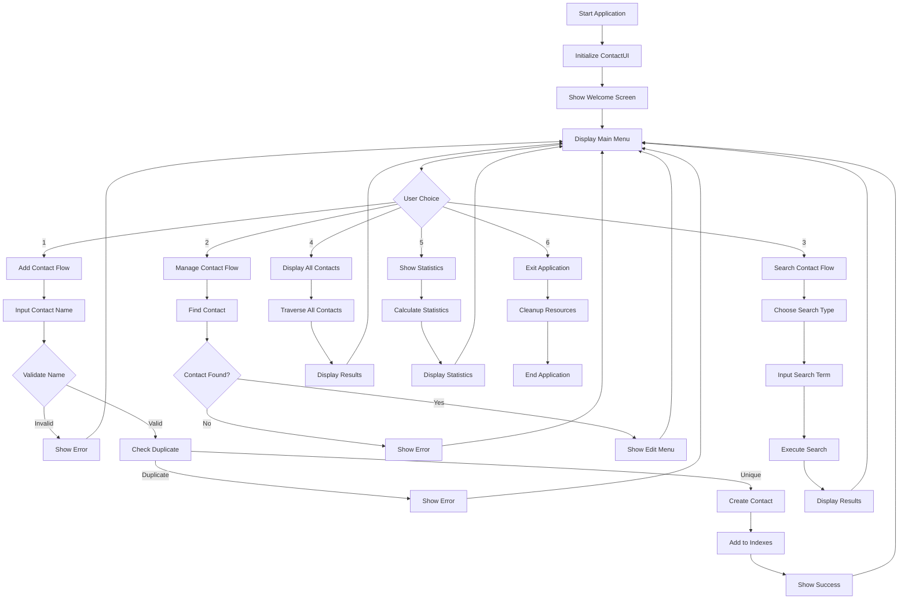
```mermaid
flowchart TD
    A[Start Application] --> B[Initialize ContactUI]
    B --> C[Show Welcome Screen]
    C --> D[Display Main Menu]
    D --> E{User Choice}
    
    E -->|1| F[Add Contact Flow]
    E -->|2| G[Manage Contact Flow]
    E -->|3| H[Search Contact Flow]
    E -->|4| I[Display All Contacts]
    E -->|5| J[Show Statistics]
    E -->|6| K[Exit Application]
    
    F --> L[Input Contact Name]
    L --> M{Validate Name}
    M -->|Invalid| N[Show Error]
    M -->|Valid| O[Check Duplicate]
    O -->|Duplicate| P[Show Error]
    O -->|Unique| Q[Create Contact]
    Q --> R[Add to Indexes]
    R --> S[Show Success]
    
    G --> T[Find Contact]
    T --> U{Contact Found?}
    U -->|No| V[Show Error]
    U -->|Yes| W[Show Edit Menu]
    
    H --> X[Choose Search Type]
    X --> Y[Input Search Term]
    Y --> Z[Execute Search]
    Z --> AA[Display Results]
    
    I --> BB[Traverse All Contacts]
    BB --> CC[Display Results]
    
    J --> DD[Calculate Statistics]
    DD --> EE[Display Statistics]
    
    N --> D
    P --> D
    S --> D
    V --> D
    W --> D
    AA --> D
    CC --> D
    EE --> D
    
    K --> FF[Cleanup Resources]
    FF --> GG[End Application]
```

### **2.  DỊCH CHUYỂN HOẠT ĐỘNG TÌM KIẾM**

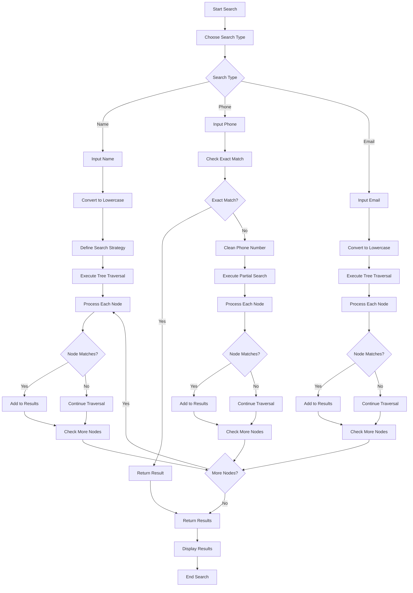
```mermaid
flowchart TD
    A[Start Search] --> B[Choose Search Type]
    B --> C{Search Type}
    
    C -->|Name| D[Input Name]
    C -->|Phone| E[Input Phone]
    C -->|Email| F[Input Email]
    
    D --> G[Convert to Lowercase]
    G --> H[Define Search Strategy]
    H --> I[Execute Tree Traversal]
    
    E --> J[Check Exact Match]
    J --> K{Exact Match?}
    K -->|Yes| L[Return Result]
    K -->|No| M[Clean Phone Number]
    M --> N[Execute Partial Search]
    
    F --> O[Convert to Lowercase]
    O --> P[Execute Tree Traversal]
    
    I --> Q[Process Each Node]
    Q --> R{Node Matches?}
    R -->|Yes| S[Add to Results]
    R -->|No| T[Continue Traversal]
    
    N --> U[Process Each Node]
    U --> V{Node Matches?}
    V -->|Yes| W[Add to Results]
    V -->|No| X[Continue Traversal]
    
    P --> Y[Process Each Node]
    Y --> Z{Node Matches?}
    Z -->|Yes| AA[Add to Results]
    Z -->|No| BB[Continue Traversal]
    
    S --> CC[Check More Nodes]
    T --> CC
    W --> DD[Check More Nodes]
    X --> DD
    AA --> EE[Check More Nodes]
    BB --> EE
    
    CC --> FF{More Nodes?}
    DD --> FF
    EE --> FF
    
    FF -->|Yes| Q
    FF -->|No| GG[Return Results]
    
    L --> GG
    GG --> HH[Display Results]
    HH --> II[End Search]
```

---

## SƠ ĐỒ TRẠNG THÁI (CHUẨN UML 2.5)

### **1.  TRẠNG THÁI LIÊN HỆ**

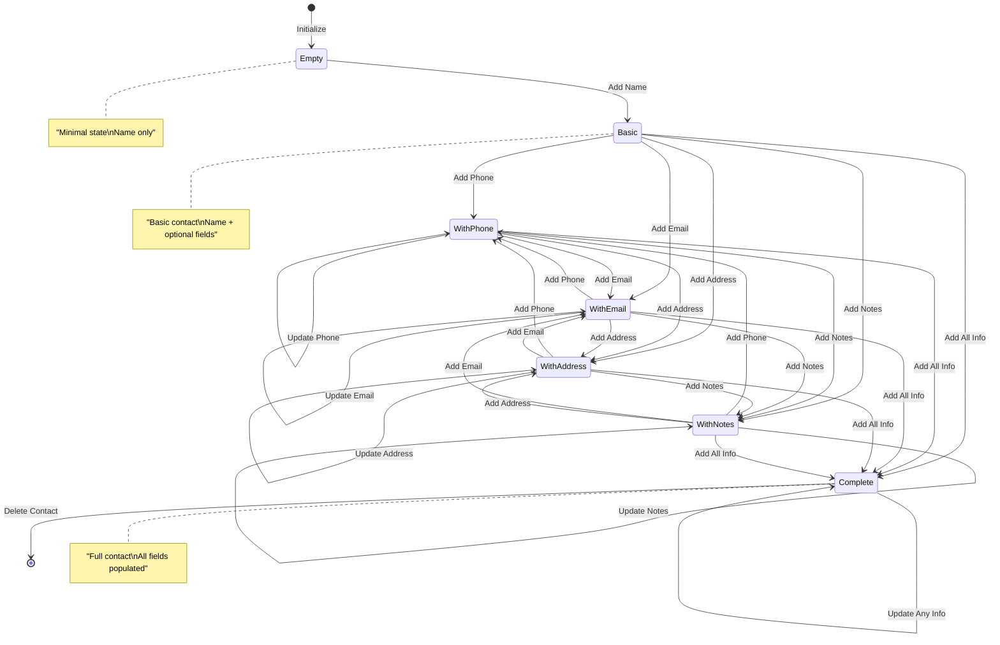
```mermaid
stateDiagram-v2
    [*] --> Empty: Initialize
    Empty --> Basic: Add Name
    Basic --> WithPhone: Add Phone
    Basic --> WithEmail: Add Email
    Basic --> WithAddress: Add Address
    Basic --> WithNotes: Add Notes
    Basic --> Complete: Add All Info
    
    WithPhone --> WithPhone: Update Phone
    WithPhone --> WithEmail: Add Email
    WithPhone --> WithAddress: Add Address
    WithPhone --> WithNotes: Add Notes
    WithPhone --> Complete: Add All Info
    
    WithEmail --> WithPhone: Add Phone
    WithEmail --> WithEmail: Update Email
    WithEmail --> WithAddress: Add Address
    WithEmail --> WithNotes: Add Notes
    WithEmail --> Complete: Add All Info
    
    WithAddress --> WithPhone: Add Phone
    WithAddress --> WithEmail: Add Email
    WithAddress --> WithAddress: Update Address
    WithAddress --> WithNotes: Add Notes
    WithAddress --> Complete: Add All Info
    
    WithNotes --> WithPhone: Add Phone
    WithNotes --> WithEmail: Add Email
    WithNotes --> WithAddress: Add Address
    WithNotes --> WithNotes: Update Notes
    WithNotes --> Complete: Add All Info
    
    Complete --> Complete: Update Any Info
    Complete --> [*]: Delete Contact
    
    note right of Empty : "Minimal state\nName only"
    note right of Basic : "Basic contact\nName + optional fields"
    note right of Complete : "Full contact\nAll fields populated"
```

### **2.  TRẠNG THÁI ỨNG DỤNG**

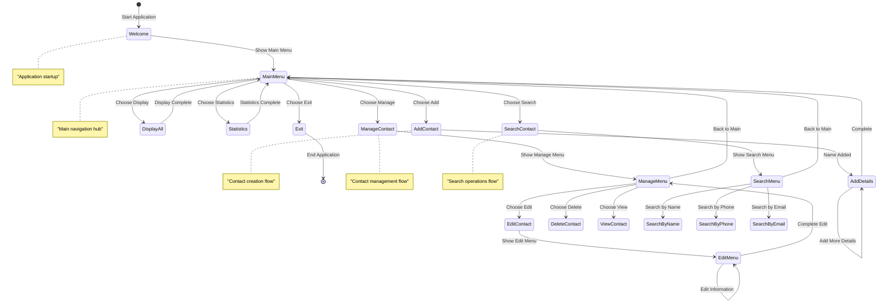
```mermaid
stateDiagram-v2
    [*] --> Welcome: Start Application
    Welcome --> MainMenu: Show Main Menu
    MainMenu --> AddContact: Choose Add
    MainMenu --> ManageContact: Choose Manage
    MainMenu --> SearchContact: Choose Search
    MainMenu --> DisplayAll: Choose Display
    MainMenu --> Statistics: Choose Statistics
    MainMenu --> Exit: Choose Exit
    
    AddContact --> AddDetails: Name Added
    AddDetails --> AddDetails: Add More Details
    AddDetails --> MainMenu: Complete
    
    ManageContact --> ManageMenu: Show Manage Menu
    ManageMenu --> EditContact: Choose Edit
    ManageMenu --> DeleteContact: Choose Delete
    ManageMenu --> ViewContact: Choose View
    ManageMenu --> MainMenu: Back to Main
    
    EditContact --> EditMenu: Show Edit Menu
    EditMenu --> EditMenu: Edit Information
    EditMenu --> ManageMenu: Complete Edit
    
    SearchContact --> SearchMenu: Show Search Menu
    SearchMenu --> SearchByName: Search by Name
    SearchMenu --> SearchByPhone: Search by Phone
    SearchMenu --> SearchByEmail: Search by Email
    SearchMenu --> MainMenu: Back to Main
    
    DisplayAll --> MainMenu: Display Complete
    Statistics --> MainMenu: Statistics Complete
    
    Exit --> [*]: End Application
    
    note right of Welcome : "Application startup"
    note right of MainMenu : "Main navigation hub"
    note right of AddContact : "Contact creation flow"
    note right of ManageContact : "Contact management flow"
    note right of SearchContact : "Search operations flow"
```

---

##  SƠ ĐỒ ĐỐI TƯỢNG (CHUẬN UML 2.5)

### **1.  VÍ DỤ THỂ HIỆN HỆ THỐNG**

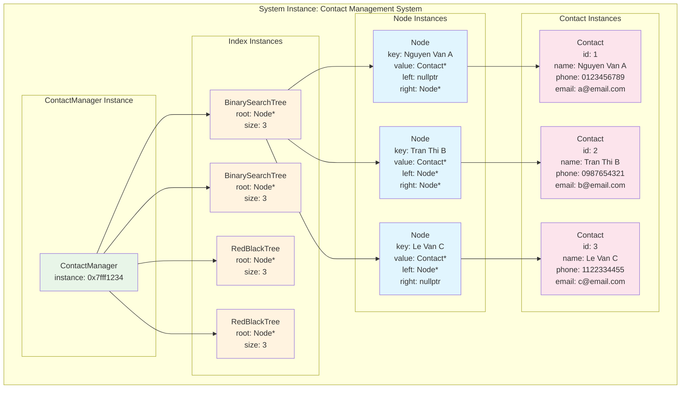
```mermaid
graph TB
    subgraph "System Instance: Contact Management System"
        subgraph "ContactManager Instance"
            CM[ContactManager<br/>instance: 0x7fff1234]
        end
        
        subgraph "Contact Instances"
            C1[Contact<br/>id: 1<br/>name: Nguyen Van A<br/>phone: 0123456789<br/>email: a@email.com]
            C2[Contact<br/>id: 2<br/>name: Tran Thi B<br/>phone: 0987654321<br/>email: b@email.com]
            C3[Contact<br/>id: 3<br/>name: Le Van C<br/>phone: 1122334455<br/>email: c@email.com]
        end
        
        subgraph "Index Instances"
            BST1[BinarySearchTree<br/>root: Node*<br/>size: 3]
            BST2[BinarySearchTree<br/>root: Node*<br/>size: 3]
            RBT1[RedBlackTree<br/>root: Node*<br/>size: 3]
            RBT2[RedBlackTree<br/>root: Node*<br/>size: 3]
        end
        
        subgraph "Node Instances"
            N1[Node<br/>key: Nguyen Van A<br/>value: Contact*<br/>left: nullptr<br/>right: Node*]
            N2[Node<br/>key: Tran Thi B<br/>value: Contact*<br/>left: Node*<br/>right: Node*]
            N3[Node<br/>key: Le Van C<br/>value: Contact*<br/>left: Node*<br/>right: nullptr]
        end
    end
    
    CM --> BST1
    CM --> BST2
    CM --> RBT1
    CM --> RBT2
    
    BST1 --> N1
    BST1 --> N2
    BST1 --> N3
    
    N1 --> C1
    N2 --> C2
    N3 --> C3
    
    style CM fill:#e8f5e8
    style C1 fill:#fce4ec
    style C2 fill:#fce4ec
    style C3 fill:#fce4ec
    style BST1 fill:#fff3e0
    style BST2 fill:#fff3e0
    style RBT1 fill:#fff3e0
    style RBT2 fill:#fff3e0
    style N1 fill:#e1f5fe
    style N2 fill:#e1f5fe
    style N3 fill:#e1f5fe
```

---

##  GHI CHÚ VỀ TRIỂN KHAI

### **1.  BẢNG KIỂM TRA VIỆC TUÂN THỦ UML**

-  **Sơ đồ lớp**: Stereotypes, độ truy cập, quan hệ
-  **Sơ đồ dịch chuyển**: Lifelines, tin nhắn, thanh hoạt động
-  **Sơ đồ thành phần**: Thành phần, giao diện, phụ thuộc
-  **Sơ đồ hoạt động**: Hành động, quyết định, dòng, swimlanes
-  **Sơ đồ trạng thái**: Trạng thái, chuyển tiếp, sự kiện, hành động
-  **Sơ đồ đối tượng**: Ví dụ thể hiện, quan hệ đối tượng

### **2.  ÁNH XẠ CHIẾN LƯỢC PATTERN**

| Phần tử UML | Pattern thiết kế | Triển khai |
|-------------|----------------|----------------|
| **Singleton** | ContactManager | Thể hiện độc nhất + getInstance() |
| **Template Method** | BST/RBT | Cấu trúc thuật toán duyệt |
| **Strategy** | Hoạt động tìm kiếm | std::function callbacks |
| **Factory** | Tạo liên hệ | phương thức addContact() |
| **Observer** | Đồng bộ chỉ mục | phương thức addToIndexes() |
| **MVC** | ContactUI | Phân tách View + Controller |

### **3.  CÁC LOẠI QUAN HỆ**

- **Quan hệ kết nối**: ContactManager quản lý các đối tượng Contact
- **Quan hệ kết hợp**: ContactManager chứa các cấu trúc cây
- **Quan hệ tổng hợp**: Các cấu trúc cây chứa con trỏ Contact
- **Phụ thuộc**: UI phụ thuộc vào ContactManager
- **Kế thừa**: Tổ hiệp lỗi

---

##  PHÂN TÍCH HIỆU SUẤT

### **1. ⏱ ĐỘ PHỨC TẠP THỜI GIAN**

| Hoạt động | BST (Trung bình) | BST (Tệ nhất) | RBT (Đảm bảo) |
|-----------|---------------|-------------|------------------|
| **Chèn** | O(log n) | O(n) | O(log n) |
| **Tìm kiếm** | O(log n) | O(n) | O(log n) |
| **Xóa** | O(log n) | O(n) | O(log n) |
| **Duyệt** | O(n) | O(n) | O(n) |

### **2.  ĐỘ PHỨC TẠP KHÔNG GIAN**

| Thành phần | Độ phức tạp không gian | Chi tiết |
|-----------|------------------|---------|
| **Đối tượng liên hệ** | O(n) | n liên hệ với dữ liệu không đổi |
| **Cấu trúc cây** | O(n) | n nút với chi phí cố định |
| **Quản lý chỉ mục** | O(n) | Nhiều chỉ mục, mỗi O(n) |
| **Hệ thống tổng thể** | O(n) | Tuyến tính với số lượng liên hệ |

---

##  KẾT LUẬN

Tài liệu UML này tuân thủ chuẩn **UML 2.5** và cung cấp cái nhìn toàn diện về kiến trúc hệ thống Quản lý Danh bạ Thông minh. Các biểu đồ được thiết kế để:

1. ** Rõ ràng**: Hiểu rõ cấu trúc và quan hệ
2. ** Triển khai**: Hướng dẫn phát triển
3. ** Tài liệu kỹ thuật**: Tài liệu kỹ thuật chuẩn
4. ** Bảo trì**: Dễ dàng bảo trì và mở rộng

**Việc tuân thủ chuẩn UML:**
-  **Sơ đồ lớp**: Ký hiệu và quan hệ
-  **Sơ đồ dịch chuyển**: Luồng tin nhắn và thời gian
-  **Sơ đồ thành phần**: Kiến trúc hệ thống
-  **Sơ đồ hoạt động**: Luồng quy trình kinh doanh
-  **Sơ đồ trạng thái**: Đời sống đối tượng
-  **Sơ đồ đối tượng**: Ví dụ thể hiện

Tài liệu này có thể được sử dụng để:
- **Phát triển**: Hướng dẫn triển khai
- **Đánh giá code**: Kiểm tra việc tuân thủ thiết kế
- **Tài liệu kỹ thuật**: Tài liệu kỹ thuật
- **Đào tạo**: Hướng dẫn đào tạo nhân viên
- **Bảo trì**: Hiểu biết về hệ thống
